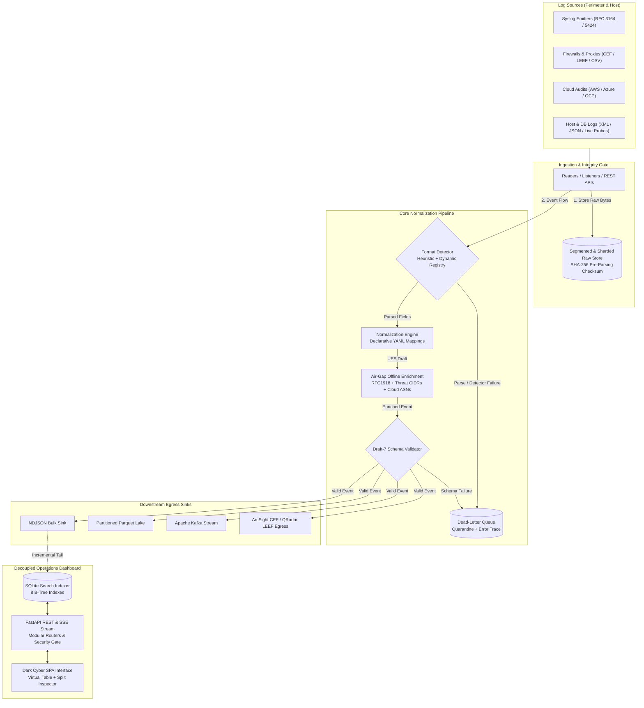

# ULPF System Architecture

Universal Log Pre-processing Framework (ULPF) is a vendor-agnostic, lossless, air-gap-safe pre-SIEM telemetry gateway. It ingests multi-vendor perimeter logs, preserves authentic raw bytes with SHA-256 cryptographic verification before parsing, normalizes payloads to the Universal Event Schema (UES v1.2.0) with OCSF and ECS crosswalks, and provides an optional decoupled operations dashboard.

---

## Architecture Diagram

---

## Components

| Component Subsystem | Package Path | Primary Responsibility |
|---|---|---|
| **Ingestion Layer** | `src/ulpf/core/ingestion.py`, `collectors/` | Stream/batch reading (File, Stdin, UDP/TCP Syslog on port 1514, Win32 Live Monitor) producing immutable `RawEvent` records. |
| **Forensic Raw Store** | `src/ulpf/core/raw_store.py`, `segmented_raw_store.py` | Computes SHA-256 on authentic bytes and persists payloads *before* detection; supports 2-tier hex sharded files or binary append-only chunks (`.bin`) with $O(1)$ seek. |
| **Detector & Registry** | `src/ulpf/core/detector.py`, `registry.py` | Dynamic parser auto-discovery (`pkgutil`), heuristic cascade, per-source config overrides (`sources.yaml`), and declarative source registry. |
| **Normalization Engine** | `src/ulpf/core/normalization.py` | Applies declarative YAML field transforms to UES v1.2.0; unmapped fields route to open `vendor_attributes` container (zero data loss). |
| **Validation Gate** | `src/ulpf/core/validation.py` | Validates events against strict Draft-7 JSON schema (`ues_schema.json`); isolates malformed logs into `dead_letter.ndjson`. |
| **Offline Enrichment** | `src/ulpf/enrichment/` | In-memory lookup tables for RFC 1918 scopes, major cloud provider ASN identification, and embedded threat CIDRs with zero network egress. |
| **Statistical Analytics** | `src/ulpf/analytics/` | Welford single-pass rolling statistics ($Z > 3\sigma$, IQR outliers, rate bursts), and 24-dimensional normalized ML feature extraction. |
| **Egress Sinks** | `src/ulpf/sinks/` | Fan-out delivery: NDJSON line-delimited files, Snappy-compressed partitioned Apache Parquet (`dt=YYYY-MM-DD/tenant_id=...`), Apache Kafka, and legacy SIEM re-encoders (CEF/LEEF). |
| **Operations Dashboard** | `src/ulpf_dashboard/` | Optional FastAPI service, SQLite 8-index search engine, Server-Sent Events (SSE) telemetry, runtime port management, and single-page cyber UI. |

---

## Data Flow

1. **Ingest & Raw Capture:** Authentic raw bytes enter via CLI file/stream reader, UDP/TCP network socket listener (port 1514), or REST endpoint. SHA-256 hash is computed and stored immediately in the Raw Store.
2. **Deterministic Identity:** Idempotent `event_id` is derived using RFC 4122 `UUIDv5(namespace, tenant_id + source + raw_hash)`.
3. **Format Detection & Extraction:** Registered format plugins (11 built-in or custom declarative) match and extract syntax fields. Unrecognized formats route to dead-letter storage.
4. **Declarative Normalization:** Extracted fields map to UES v1.2.0. Unmapped elements are preserved in `vendor_attributes`. Dual crosswalk bridges map records to OCSF v1.1.0 and ECS v8.11.0.
5. **Enrichment & Validation:** In-memory network scoping and threat intelligence annotate metadata. The event is validated against Draft-7 JSON Schema.
6. **Egress Fan-Out & Relational Indexing:** Valid events fan out to configured storage sinks (NDJSON, Parquet, Kafka, CEF/LEEF). The dashboard SQLite indexer tails `events.ndjson` by byte-offset for real-time operations without mutating pipeline data.

---

## Authentication & Authorization

- **Dashboard REST API:** Write operations (`/api/ingest/*`, `/api/reindex`, `/api/live-monitor/*`) are gated behind an optional `X-API-Key` header verified against `ULPF_API_KEY`. When unset, operations run in trusted local single-user mode.
- **Read-Only Endpoints:** Operations overview, event querying, forensic lookup, and SSE streams are open for SOC operations.
- **Multi-Tenancy:** Ingestion pipeline, raw storage, parquet partitions, and SQLite queries are partitioned by `tenant_id` for strict logical tenant isolation.

---

## Database

- **Authoritative Data Store:** Flat append-only `events.ndjson` and forensic raw stores (`.raw` / `.bin`).
- **Relational Query Accelerator:** SQLite database (`indexer.db`) with 8 optimized B-Tree indexes:
  - `idx_events_timestamp`, `idx_events_category`, `idx_events_severity`, `idx_events_vendor`, `idx_events_product`, `idx_events_tenant`, `idx_events_action`, and port casting queries for instant network service lookups.
  - State tracking via `indexer_state` table recording byte offsets for zero-duplication synchronization.

---

## External Services & Integrations

- **Air-Gap Native:** Requires **zero** external network dependencies. Threat intelligence, geolocation IP ranges, and ASN routing tables are embedded statically in memory.
- **Optional Downstream Integrations:**
  - **Apache Kafka:** Real-time event streaming (`ulpf.events` topic) with automatic fallback to local files if Kafka broker is unavailable.
  - **Apache Parquet Lake:** PyArrow partitioned columnar data lake storage.

---

## Deployment & Security Controls

- **Docker Containerization:** Multi-stage build pre-bundles wheels into an offline wheelhouse; runtime container executes under `network_mode: none` for defense-grade air-gapped isolation.
- **Path Traversal Hardening:** Strict UUIDv4/v5 regular expression validation protects event identifiers before any filesystem path interpolation.
- **CORS Protection:** Dashboard CORS policy strictly disallows wildcard origins (`*`) and credentials; origin access is restricted to the host address or configurable via `ULPF_CORS_ORIGINS`.
- **Subprocess Isolation:** Background host monitoring executes with `CREATE_NO_WINDOW` and `SW_HIDE` on Windows to suppress unwanted console popup behavior.
