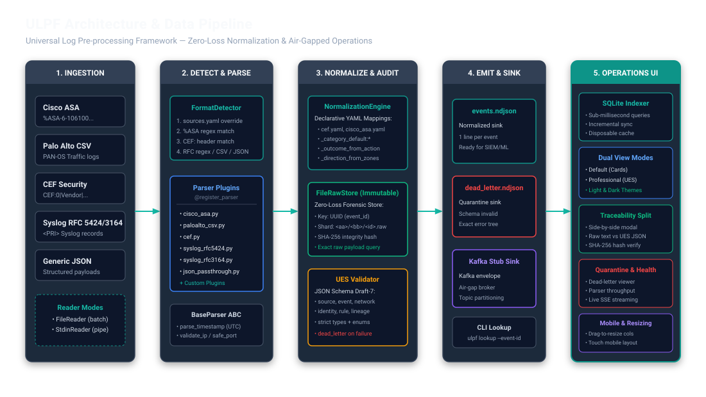
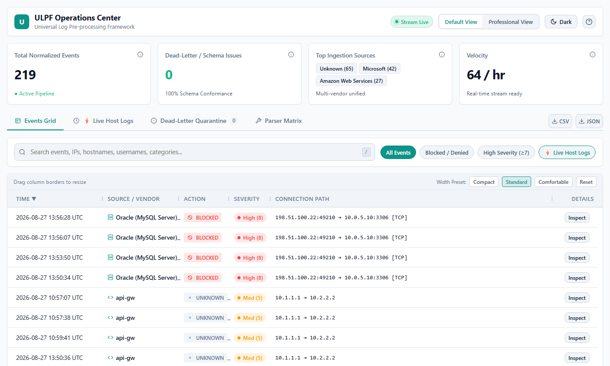
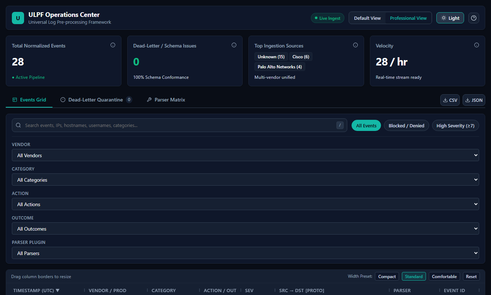
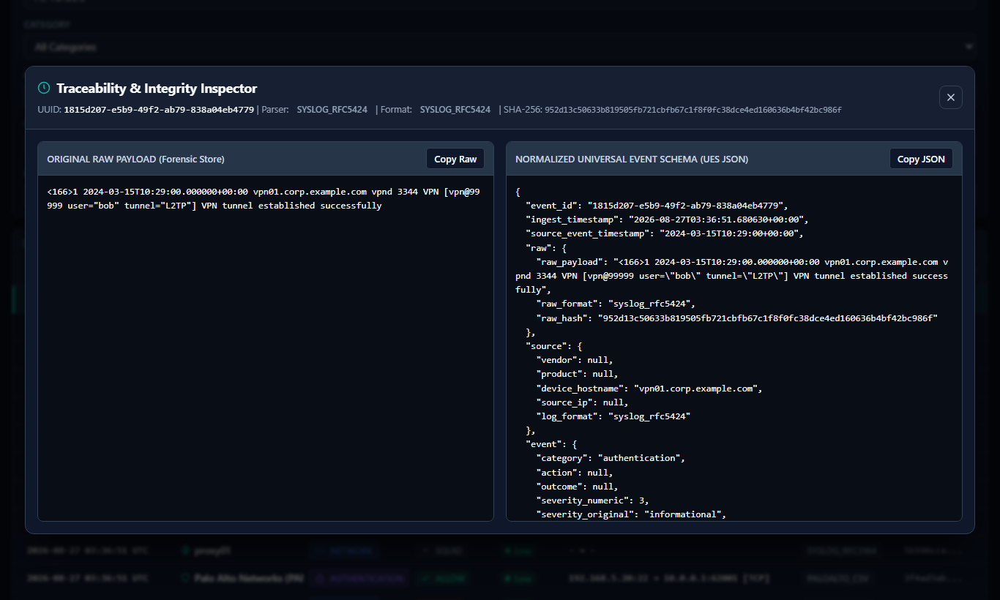
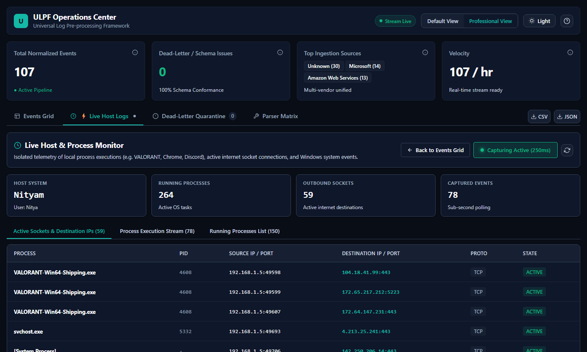

#  ULPF — Universal Log Pre-processing Framework

[](https://github.com/NotUrNio/ULPF)
[](https://www.python.org/)
[](LICENSE)
[](docker/Dockerfile)

Takes raw logs from firewalls, IDS/IPS, VPN gateways, cloud audit logs, operating systems, and proxies — any vendor, any format — and turns them into one consistent, lossless JSON schema for SIEM, data lakes, and security analytics. Supports **11 formats out of the box** (Syslog RFC 3164/5424, CEF, LEEF 1.0/2.0, Windows/Generic XML, Cisco ASA, Palo Alto CSV, AWS CloudTrail, Azure Monitor, GCP Audit, generic JSON), with a self-registering plugin system built to add more without touching a line of existing code.

Every raw event's authentic bytes are hashed and persisted **before** detection/parsing runs, and linked back to its normalized form by a deterministic UUID — so nothing is ever lost for forensic or compliance review, even a format nobody recognizes. Features live UDP/TCP syslog ingestion, offline IP & threat intelligence enrichment, a statistical anomaly detection engine, multi-process parallel scaling that actually runs, multi-sink fan-out (NDJSON/Kafka/Parquet/CEF-LEEF egress), and a high-performance web dashboard with restricted CORS and optional API-key auth.

---

## Why ULPF

- **Zero information loss** — raw bytes are hashed and written to the raw store *before* detection or parsing, so even an unrecognized format is recoverable by UUID and the hash is computed over the authentic bytes (verified for non-UTF-8 input too). Anything unmapped by a parser's YAML lands in `vendor_attributes`, not the floor.
- **11 out-of-the-box log parsers** — Syslog RFC 5424/3164, CEF (ArcSight/Fortinet/Snort/CheckPoint, syslog-wrapped or bare), LEEF 1.0/2.0 (IBM QRadar, syslog-wrapped or bare), Windows Event Log / Generic XML, Cisco ASA, Palo Alto Networks CSV, AWS CloudTrail, Azure Monitor, GCP Cloud Audit, and JSON Passthrough.
- **True plug-and-play parsers** — drop a new parser file into `parsers/` + its YAML mapping and it self-registers via `pkgutil` dynamic discovery. Zero edits to core pipeline code; the new format's identity (`raw_format`/`log_format`) survives end-to-end.
- **Live syslog ingestion** — `ulpf listen` runs a real UDP+TCP syslog receiver feeding straight into the pipeline, not just batch file/stdin.
- **Horizontal multi-process scaling that actually runs** — `ulpf ingest --workers N` streams chunked events across a `multiprocessing.Pool` without buffering the whole input in memory.
- **Multi-sink fan-out** — `--sink ndjson,parquet,cef-egress,leef-egress` writes the same normalized event to a data lake and a legacy SIEM receiver in one run.
- **Offline IP & threat enrichment** — pure Python, air-gap safe classification for RFC 1918 private ranges, loopback, link-local, cloud provider ASN recognition (AWS, Azure, GCP, Cloudflare, Akamai, Fastly), and embedded threat intel CIDRs. Enrichment only annotates — it never overwrites the source-derived severity.
- **Statistical anomaly detection engine** — pure Python Z-score deviation (>3σ), IQR byte-volume outlier detection, frequency burst detection (rate over the real observation window), rare category detection (<1%), and authentication failure chain tracking; a 24-dim ML feature extractor (`ulpf analyze --emit-features`) is available for downstream models.
- **Production & streaming sinks** — analytics-ready NDJSON, production `KafkaProducerSink` with automatic local fallback, columnar Parquet with an NDJSON fallback when `pyarrow` isn't installed, and CEF/LEEF egress for legacy SIEM receivers.
- **REST API ingestion & analytics** — `POST /api/ingest/line`, `POST /api/ingest/batch`, `POST /api/ingest/stream`, and `GET /api/analytics/anomalies`; write endpoints are gated behind an optional `X-API-Key` (`ULPF_API_KEY`), and dashboard CORS is restricted to its own origin, not a wildcard.
- **Built-in operations dashboard** — FastAPI backend with SQLite indexer, SSE live streaming, dark/light themes, default/professional views, and forensic Traceability Split Inspector.
- **Air-gapped by design** — zero external runtime calls, no CDN dependencies, local offline wheels install; runtime deps and dev/test tooling are split (`requirements.txt` vs `requirements-dev.txt`) so the wheelhouse and Docker image stay minimal.
- **132 tests, all green** — unit, parser-level, anomaly engine, worker pool, REST API, and end-to-end integration tests.

---

## Architecture



---

## Screenshots

| Default View (Overview) | Professional View (SOC Operations) |
|---|---|
|  |  |

| Traceability Forensic Split Inspector | Live Host & Process Monitor |
|---|---|
|  |  |

---

## Supported Log Formats

| Format / Source | Parser Plugin | Supported Features |
|---|---|---|
| **Syslog RFC 5424** | `syslog_rfc5424.py` | Priority, facility, severity, ID47 structured data |
| **Syslog RFC 3164** | `syslog_rfc3164.py` | BSD syslog, automatic year injection, process PID |
| **CEF (Common Event Format)** | `cef.py` | ArcSight, Fortinet, Snort, CheckPoint, extension key-values |
| **LEEF 1.0 & 2.0** | `leef.py` | IBM QRadar format, custom delimiters (`^`), standard attributes |
| **Windows / Generic XML** | `xml_generic.py` | Windows EventLog 4624/4625/etc., generic XML tag flattening |
| **Cisco ASA** | `cisco_asa.py` | `%ASA-` mnemonic parsing, ACL rule names, 5-tuple extraction |
| **Palo Alto Networks CSV** | `paloalto_csv.py` | PAN-OS 35+ column traffic log mapping, action normalization |
| **AWS CloudTrail** | `aws_cloudtrail.py` | S3, EC2, IAM, STS JSON events, error code outcome mapping |
| **Azure Monitor** | `azure_monitor.py` | Activity logs, resource ID parsing, caller IP & identity claims |
| **GCP Cloud Audit** | `gcp_audit.py` | `protoPayload` audit logs, method names, authorization status |
| **Generic JSON** | `json_passthrough.py` | Arbitrary structured JSON logs with automatic field mapping |

---

## Requirements

- Python 3.11+
- pip 23+
- Dependencies: `pyyaml`, `jsonschema`, `click`, `python-dateutil`, `pydantic`, `fastapi`, `uvicorn`
- Optional: `kafka-python` (`pip install ulpf[kafka]`, for live Kafka streaming — falls back to local NDJSON otherwise)
- Optional: `pyarrow` (`pip install ulpf[parquet]`, for real columnar Parquet output — falls back to partitioned NDJSON otherwise)

---

## Install

```bash
git clone https://github.com/NotUrNio/ULPF.git
cd ULPF
pip install -e .[dev]
```

Verify installed parsers:

```bash
ulpf list-parsers
```

### Offline install (air-gapped environment)

```bash
# On an internet-connected machine (requirements.txt is runtime-only —
# dev/test tooling lives in requirements-dev.txt and is not needed in
# an air-gapped deployment):
pip download -r requirements.txt -d ./wheelhouse
pip wheel . --no-deps -w ./wheelhouse

# Copy wheelhouse/ to the air-gapped machine, then:
pip install --no-index --find-links ./wheelhouse -r requirements.txt
pip install --no-index --find-links ./wheelhouse ulpf
```

---

## Usage

### Ingest Logs

```bash
# Ingest all sample logs into NDJSON + Raw Store
ulpf ingest --input ulpf/sample_logs/ --output output/

# Ingest single file
ulpf ingest --input ulpf/sample_logs/cisco_asa.log --output output/

# Ingest from stdin (pipe)
cat /var/log/syslog | ulpf ingest --input - --output output/

# Ingest with 4 parallel worker processes (streams chunks, doesn't buffer the whole input)
ulpf ingest --input /var/log/sources/ --output output/ --workers 4

# Ingest directly to Kafka topic (with auto local fallback)
ulpf ingest --input ulpf/sample_logs/ --output output/ --sink kafka-real

# Fan out to multiple sinks in one run: NDJSON + Parquet data lake + legacy CEF/LEEF egress
ulpf ingest --input ulpf/sample_logs/ --output output/ --sink ndjson,parquet,cef-egress,leef-egress

# Tag events from a specific tenant/business unit
ulpf ingest --input /var/log/tenant-a/ --output output/ --tenant-id tenant-a
```

### Live Syslog Ingestion

```bash
# Real UDP+TCP syslog receiver feeding straight into the pipeline
ulpf listen --port 1514 --output output/
```

### Statistical Anomaly Analysis

```bash
# Run statistical anomaly detection over normalized events
ulpf analyze --input output/events.ndjson --output output/anomalies.ndjson

# Also emit a 24-dim ML feature vector per event (output/features.ndjson)
ulpf analyze --input output/events.ndjson --emit-features
```

### Forensic Raw Store Lookup

```bash
# Retrieve original raw payload and verify SHA-256 hash by event UUID
ulpf lookup --event-id d0f0b096-9b96-43ff-ac78-e4bce3caa108
```

### Launch Web Dashboard

```bash
ulpf dashboard --port 8000 --output-dir output/
# Navigate to http://127.0.0.1:8000

# Require an API key on write endpoints (ingest/reindex/live-monitor) and
# restrict CORS to a specific origin, e.g. when exposing beyond localhost:
ULPF_API_KEY=change-me ULPF_CORS_ORIGINS=http://localhost:8000 ulpf dashboard --port 8000
```

By default (no `ULPF_API_KEY` set) the dashboard is a trusted single-user
local tool — CORS is still restricted to its own origin (never a wildcard),
but write endpoints are open. Set `ULPF_API_KEY` for any deployment reachable
by more than one person or bound to a non-loopback address.

---

## REST API Ingestion & Endpoints

| Method | Endpoint | Description | Auth |
|---|---|---|---|
| `POST` | `/api/ingest/line` | Ingest single raw line: `{"line": "..."}` | `X-API-Key` if `ULPF_API_KEY` set |
| `POST` | `/api/ingest/batch` | Ingest array of lines: `{"lines": [...]}` | `X-API-Key` if `ULPF_API_KEY` set |
| `POST` | `/api/ingest/stream` | Stream chunked NDJSON body | `X-API-Key` if `ULPF_API_KEY` set |
| `POST` | `/api/reindex` | Rebuild the SQLite index from `events.ndjson` | `X-API-Key` if `ULPF_API_KEY` set |
| `GET` | `/api/events` | Paginated, sorted, filtered UES events | open |
| `GET` | `/api/events/{event_id}` | Event detail + untouched raw payload from RawStore | open |
| `GET` | `/api/stats` | Aggregate metrics (totals, categories, vendors, severities) | open |
| `GET` | `/api/parsers` | Parser plugin registry health and event counts | open |
| `GET` | `/api/dead-letter` | Quarantine queue with validation failure reasons | open |
| `GET` | `/api/analytics/anomalies`| Top anomalous events with scores and reasoning | open |
| `GET` | `/api/export` | Stream CSV or NDJSON data dump | open |
| `GET` | `/api/stream` | Server-Sent Events (SSE) real-time event feed | open |
| `POST` | `/api/live-monitor/start`, `/stop` | Host process/socket telemetry capture | `X-API-Key` if `ULPF_API_KEY` set |

---

## Adding a New Parser Plugin

Creating a new parser requires **zero modifications to core code**:

1. **Create `ulpf/parsers/my_device.py`:**
```python
from ulpf.parsers.base import BaseParser
from ulpf.core.registry import register_parser

@register_parser
class MyDeviceParser(BaseParser):
    name = "my_device"
    version = "1.0.0"
    log_format = "syslog_rfc3164"

    def match(self, raw_line: str) -> bool:
        return "MY_TAG" in raw_line

    def extract(self, raw_line: str) -> dict:
        ts = self.parse_timestamp("...")
        return {
            "_raw": raw_line,
            "_log_format": self.log_format,
            "timestamp_dt": ts.isoformat() if ts else None,
            "src_ip": self.validate_ip("..."),
            "src_port": self.safe_port("..."),
            "severity_ues": 5,
        }
```

2. **Create `ulpf/schemas/mappings/my_device.yaml`:**
```yaml
ruleset_version: "1.0.0"
source:
  vendor: _literal:MyVendor
  product: _literal:MyProduct
  device_hostname: hostname
  source_ip: null
  log_format: syslog_rfc3164
event:
  category: _category_default:network
  action: action
  outcome: _outcome_from_action
  severity_numeric: severity_ues
  severity_original: null
  event_type_vendor_specific: null
network:
  src_ip: src_ip
  src_port: src_port
  dst_ip: null
  dst_port: null
  protocol: null
  bytes_in: null
  bytes_out: null
  direction: null
  interface: null
identity:
  username: null
  user_domain: null
rule:
  rule_id: null
  rule_name: null
  policy_action: null
```

3. **Verify:**
```bash
ulpf list-parsers  # my_device appears automatically
```

---

## Tests

```bash
# Run Master System Verification (Tests VPN, Cloud, MySQL, Windows, Live Host, SHA-256)
python test_all.py

# Run all 132 unit and integration tests via Pytest
pytest ulpf/tests/ -v

# Run with test coverage
pytest ulpf/tests/ -v --cov=ulpf --cov-report=term-missing
```

---

## Docker Deployment

```bash
# Build air-gapped image
docker compose -f docker/docker-compose.yml build

# Run pipeline + dashboard
docker compose -f docker/docker-compose.yml up
```

---

## License

[MIT](LICENSE) © 2026 NotUrNio
