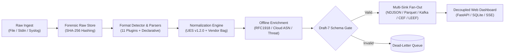

# Universal Log Pre-processing Framework (ULPF)

<p align="center">
  
</p>

<p align="center">
  <a href="https://github.com/harshwardhan1507/SIH26156-mergeconflicts"></a>
  <a href="https://www.python.org/"></a>
  <a href="LICENSE"></a>
  <a href="deploy/docker/Dockerfile"></a>
  <a href="ARCHITECTURE.md"></a>
</p>

<p align="center">
  
  
  
  
  
  
</p>

---

## Overview

**Universal Log Pre-processing Framework (ULPF)** is an enterprise, high-performance, vendor-agnostic pre-SIEM normalization gateway. Heterogeneous telemetry emitted across IT perimeters—firewalls, routers, cloud providers, databases, and host systems—arrives in dozens of conflicting syntaxes, non-standard timestamps, and fragmented schemas. Traditional pipelines either drop unmapped attributes, fail silently, or cause severe vendor lock-in.

ULPF solves these critical operational challenges by sitting directly between raw log emitters and downstream data platforms:
1. **Zero Information Loss:** Stores authentic raw bytes and computes pre-parsing SHA-256 checksums before format detection or parsing occurs.
2. **Universal Standardization:** Normalizes 11 industry formats into **Universal Event Schema (UES v1.2.0)** with dual **OCSF v1.1.0** and **ECS v8.11.0** crosswalks.
3. **Forensic Integrity:** Guarantees bidirectional lineage and deterministic UUIDv5 event traceability for tamper-evident compliance.
4. **Air-Gap Native:** Operates in classified and isolated networks with pure Python offline CIDR enrichment and zero outbound network calls.
5. **Modular Decoupling:** Complete separation of the core pipelining engine (`src/ulpf`) from the operations dashboard (`src/ulpf_dashboard`).

---

## Features

- **Segmented & Sharded Raw Storage:** Preserves authentic raw bytes on disk *prior* to parsing. Supports high-throughput append-only binary chunk storage (`.bin`) with $O(1)$ random seek and cryptographic verification.
- **11 Out-of-the-Box Parsers:** Built-in extraction for Syslog RFC 5424 / 3164, ArcSight CEF, IBM QRadar LEEF 1.0/2.0, Cisco ASA (%ASA-), Palo Alto Networks CSV, AWS CloudTrail JSON, Azure Monitor, GCP Cloud Audit (`protoPayload`), Windows Event Log / Generic XML, and Generic JSON Passthrough.
- **Declarative No-Code Onboarding:** Onboard custom proprietary formats using simple YAML mapping files (`src/ulpf/schemas/declarative_sources/`) with automatic format and field inference.
- **Common Event Taxonomy:** Full taxonomy alignment with Open Cybersecurity Schema Framework (OCSF Classes 4001, 3001, 2001, 1001, 5001, 6004) and Elastic Common Schema (ECS v8.11.0).
- **Zero-Drop Dead-Letter Queue:** Invalid or unparseable logs are quarantined with full error traces and preserved raw references into `dead_letter.ndjson`.
- **Multi-Sink Fan-Out:** Concurrently streams normalized events across NDJSON bulk files, Snappy-compressed columnar Apache Parquet data lakes, Apache Kafka, and legacy SIEM re-encoders (CEF/LEEF).
- **Air-Gapped Offline Enrichment:** In-memory RFC 1918 private IP classification, major cloud ASN detection (AWS, Azure, GCP, Cloudflare), and embedded threat intelligence with zero external API calls.
- **Statistical Anomaly Engine:** Single-pass Welford rolling statistics ($Z > 3\sigma$, IQR outliers, frequency burst detection), and 24-dimensional normalized ML feature vector extraction.
- **Modular Cyber Dashboard:** Decoupled FastAPI web interface with SQLite 8-index search engine, SSE real-time streaming, forensic split inspector, runtime port switcher (default 7000), and dark cyber styling.
- **Robust Cross-Platform Automation:** 1-click Windows batch scripts, silent desktop launchers, systemd service descriptors, and macOS launchctl configurations.

---

## Tech Stack

- **Core Engine:** Python 3.11+ (tested on 3.11, 3.12, 3.13)
- **Validation & Data Models:** Pydantic v2, PyYAML, jsonschema (Draft-7)
- **Data Lake & Storage:** PyArrow (Apache Parquet columnar storage with date/tenant partitioning), SQLite 3
- **Streaming & Messaging:** Apache Kafka (`kafka-python`) with local resilient fallback
- **Web Backend:** FastAPI, Starlette, Uvicorn (ASGI)
- **Frontend UI:** Vanilla ES6+ JavaScript, CSS3 Cyber Design System (Zero heavy frontend dependencies)
- **Testing & Code Quality:** Pytest, Pytest-Asyncio, Pytest-Cov, Ruff, Mypy
- **Deployment:** Multi-stage Docker, PyInstaller, Wix Toolset (MSI), Debian packaging tools

---

## Architecture

For the complete technical specification, subsystem contracts, and architectural diagrams, see:
👉 [**ARCHITECTURE.md**](ARCHITECTURE.md)



---

## Requirements

- **Python:** Version 3.11 or newer
- **Package Manager:** `pip` (v23.0+)
- **Operating System:** Cross-platform (Windows 10/11/Server, Ubuntu/Debian Linux, macOS)
- **Hardware Footprint:** Minimal (runs smoothly on 2 cores, 2 GB RAM; scales horizontally with multi-core streaming)

---

## Installation

### 1. Clone the Repository
```bash
git clone https://github.com/harshwardhan1507/SIH26156-mergeconflicts.git
cd ULPF
```

### 2. Install Packages

```bash
# Option A: Core Framework Only (No web server dependencies)
pip install -e .

# Option B: Framework + Decoupled Operations Dashboard
pip install -e ".[dashboard]"

# Option C: Complete Development & Tooling Suite
pip install -e ".[dev]"
```

### 3. Air-Gapped / Disconnected Network Installation
```bash
# On an internet-connected host:
pip wheel ".[dashboard]" -w ./wheelhouse

# Transfer ./wheelhouse to the isolated system and install:
pip install --no-index --find-links ./wheelhouse ulpf
```

---

## Environment Variables

Copy the provided sanitized configuration template to initialize your environment:

```bash
cp .env.example .env
```

| Variable Name | Default Value | Description |
|---|---|---|
| `ULPF_API_KEY` | *(None / Empty)* | Optional API key protecting write endpoints (`/api/ingest/*`, `/api/reindex`, `/api/live-monitor/*`). |
| `ULPF_CORS_ORIGINS` | `http://127.0.0.1:7000,http://localhost:7000` | Comma-separated list of allowed HTTP origins for CORS policy. |
| `ULPF_OUTPUT_DIR` | `output` | Default root directory for raw stores, SQLite indexer, and NDJSON outputs. |
| `ULPF_DATA_DIR` | *(System AppData / XDG)* | Base override path for persistent application runtime data. |
| `ULPF_SOURCES_DIR` | *(Package Defaults)* | Directory override for custom declarative source YAML configurations. |
| `ULPF_PROBE_MYSQL_HOST` | *(Empty)* | Target hostname for optional live MySQL security probe. |
| `ULPF_PROBE_MYSQL_PORT` | `3306` | Port for optional live MySQL security probe. |
| `ULPF_PROBE_MYSQL_USER` | *(Empty)* | Username for optional live MySQL security probe. |
| `ULPF_PROBE_MYSQL_PASSWORD`| *(Empty)* | Password for optional live MySQL security probe. |

*Note: Real passwords, private keys, or API tokens must never be committed to source control.*

---

## Development & Usage

### 1. Ingest Raw Logs
```bash
# Ingest all sample logs into NDJSON + Raw Store:
ulpf ingest --input examples/sample_logs/ --output output/

# Ingest with 4 parallel worker processes (streams chunks without RAM bloat):
ulpf ingest --input /var/log/audit/ --output output/ --workers 4

# Multi-sink concurrent fan-out (NDJSON, Parquet lake, and legacy CEF/LEEF egress):
ulpf ingest --input examples/sample_logs/ --output output/ --sink ndjson,parquet,cef-egress,leef-egress
```

### 2. Live Network Syslog Receiver
```bash
# Start dual UDP+TCP syslog daemon on port 1514:
ulpf listen --port 1514 --output output/
```

### 3. Statistical Anomaly Analysis & ML Features
```bash
# Profile events and emit statistical anomaly scores:
ulpf analyze --input output/events.ndjson --output output/anomalies.ndjson

# Generate 24-dimensional normalized ML feature vectors:
ulpf analyze --input output/events.ndjson --emit-features
```

### 4. Forensic Raw Store Verification
```bash
# Retrieve original untouched byte payload and verify SHA-256 checksum:
ulpf lookup --event-id <EVENT_UUID>
```

### 5. Launch Operations Dashboard
```bash
# Run dashboard on default port 7000:
Run_Dashboard.bat
# Or via CLI:
ulpf dashboard --port 7000 --output-dir output/
```

---

## Build & Testing

```bash
# Run complete test suite (257 tests across unit, integration, and dashboard):
pytest

# Execute master criteria verification and smoke test:
python tests/system_verification.py

# Lint and typecheck:
ruff check src tests
mypy

# Build standalone distribution wheel and source tarball:
python -m build
```

---

## Project Structure

```text
.
├── src/
│   ├── ulpf/                       # Core Framework (Zero web server dependencies)
│   │   ├── core/                   # Ingestion, raw store, detection, normalization, validation, worker pool
│   │   ├── parsers/                # 11 format parser plugins (CEF, LEEF, ASA, CloudTrail, XML, etc.)
│   │   ├── schemas/                # Draft-7 JSON schema & declarative YAML source mappings
│   │   ├── collectors/             # Network syslog listener & live host monitor
│   │   ├── sinks/                  # Output sinks (NDJSON, Parquet, Kafka, CEF/LEEF egress)
│   │   ├── enrichment/             # Pure Python offline IP/threat/cloud ASN intelligence
│   │   ├── analytics/              # Welford baseline profiler & 24-dim ML feature extractor
│   │   └── crosswalk/              # OCSF v1.1.0 and ECS v8.11.0 translation tables
│   └── ulpf_dashboard/             # Decoupled Operations Dashboard
│       ├── routers/                # Modular endpoints (events, ingest, monitor, settings, sources, stream)
│       ├── indexer.py              # SQLite search engine with 8 B-Tree indexes
│       ├── server.py               # Uvicorn lifecycle management & port negotiation
│       └── static/                 # Single-page application cyber interface (app.js, style.css, HTML)
├── deploy/                         # Air-gapped Docker Compose and container definitions
├── docs/                           # Architectural specs, investigation reports, SIH presentation
├── examples/sample_logs/           # Sample log datasets across all 11 supported formats
├── scripts/                        # 1-click batch launchers, silent desktop launch, and helper utilities
├── tests/                          # 257 comprehensive unit, integration, and dashboard tests
└── tools/                          # Standalone multi-platform packaging (MSI, DEB, DMG, PyInstaller)
```

---

## Contributors

ULPF was collaboratively architected, engineered, and hardened by:

- **Harsh Wardhan** ([@harshwardhan1507](https://github.com/harshwardhan1507)) — *Presentation Lead, Architecture Documentation & Rubric Alignment*
- **Aryan Tailor** ([@aryanexe07](https://github.com/aryanexe07)) — *Parser Engineering, SIEM Egress Sinks & Architecture Refactoring*
- **Yash** ([@yash-144](https://github.com/yash-144)) — *Segmented Raw Store, Test Verification Suite & Security Sanitization*
- **Nityam** ([@NotUrNio](https://github.com/NotUrNio)) — *Framework-Dashboard Decoupling, Packaging & Core Ingestion Pipeline*

---

## License

This project is licensed under the MIT License — see the [LICENSE](LICENSE) file for details.
