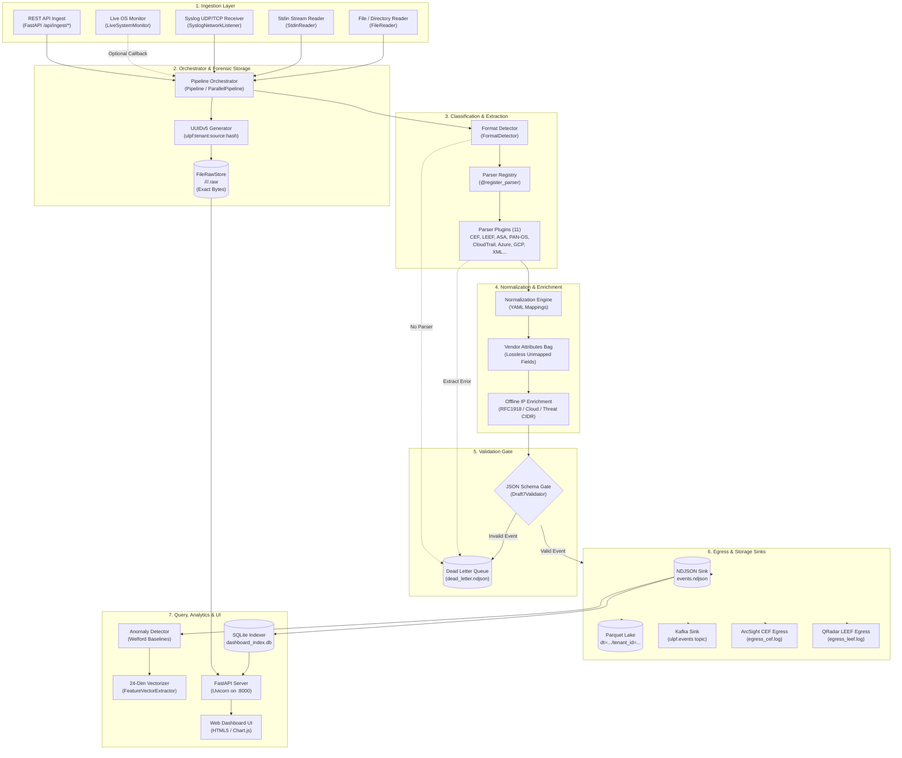

# Current System Architecture

This document provides a factual, evidence-backed reconstruction of the **as-built runtime architecture** of the Universal Log Parsing Framework (ULPF). Every component and interaction described herein is verified directly against repository source code.

---

## 1. Architectural Classification: Facts vs Inference

To maintain strict evidentiary discipline, all architectural conclusions are classified into three categories:

| Fact / Assertion | Classification | Source Code Evidence |
|---|---|---|
| Ingestion operates via `FileReader`, `StdinReader`, `SyslogNetworkListener`, and `LiveSystemMonitor`. | **CONFIRMED** | `ulpf/core/ingestion.py`, `ulpf/collectors/syslog_listener.py`, `ulpf/collectors/live_monitor.py` |
| Exact raw byte payloads are persisted to disk in `FileRawStore` *before* detection or parsing begins. | **CONFIRMED** | `ulpf/core/pipeline.py:118-119`, `ulpf/core/raw_store.py:64-75` |
| `event_id` is a deterministic UUIDv5 derived from `ulpf:{tenant_id}:{source_tag}:{raw_hash}`. | **CONFIRMED** | `ulpf/core/pipeline.py:116` |
| Format detection uses a multi-tier heuristic hierarchy (overrides -> priority regexes -> JSON signatures -> CSV -> BSD syslog -> dynamic parser registry loop -> KV -> unknown). | **CONFIRMED** | `ulpf/core/detector.py:67-137` |
| Normalization is declarative and loaded from per-parser YAML mapping files under `ulpf/schemas/mappings/`. | **CONFIRMED** | `ulpf/core/normalization.py:132-338` |
| Unmapped vendor fields are preserved in `vendor_attributes` dictionary to guarantee 100% attribute retention. | **CONFIRMED** | `ulpf/core/normalization.py:323-327` |
| Offline IP enrichment classifies RFC 1918, cloud providers, and threat intelligence CIDRs without network calls. | **CONFIRMED** | `ulpf/enrichment/ip_enrichment.py:22-209` |
| Schema validation uses JSON Schema Draft 7 against `ues_schema.json`; invalid events are routed to `dead_letter.ndjson`. | **CONFIRMED** | `ulpf/core/validation.py:35-90` |
| Events fan out to one or more sinks (`NDJSONFileSink`, `ParquetSink`, `KafkaProducerSink`, `CEFEgressSink`, `LEEFEgressSink`). | **CONFIRMED** | `ulpf/core/pipeline.py:221-240`, `ulpf/sinks/` |
| Multiprocessing parallel ingestion runs independent `Pipeline` instances across CPU workers using `multiprocessing.Pool.imap_unordered`. | **CONFIRMED** | `ulpf/core/worker_pool.py:102-179` |
| Dashboard API runs on FastAPI/Uvicorn, querying an incrementally synchronized SQLite index (`dashboard_index.db`). | **CONFIRMED** | `ulpf/dashboard/app.py:159-649`, `ulpf/dashboard/indexer.py:69-594` |
| Statistical anomaly detection uses rolling Welford baselines and Z-Score/IQR outlier scoring. | **CONFIRMED** | `ulpf/analytics/baseline.py:27-218`, `ulpf/analytics/anomaly.py:43-218` |
| UES events can be transformed into a 24-dimensional normalized float vector for downstream ML. | **CONFIRMED** | `ulpf/analytics/features.py:15-104` |
| Pipeline is horizontally scalable across multiple independent machines. | **UNKNOWN** | No clustering or distributed coordinator (e.g. Raft, Redis, Consul) exists in the codebase. Scaling is currently single-node multi-process. |

---

## 2. High-Level Architectural Block Diagram

---

## 3. Subsystem Architecture Decomposition

### 3.1 Ingestion Subsystem (`ulpf/core/ingestion.py`, `ulpf/collectors/`)
* **`ReaderBase`**: Abstract interface defining `read() -> Iterator[RawEvent]`.
* **`FileReader`**: Recursively discovers log files, reads binary streams (`rb`), strips line endings (`\r\n`), decodes with `surrogateescape`, and yields immutable `RawEvent` objects.
* **`StdinReader`**: Streams lines from `sys.stdin.buffer` for Unix pipe workflows (`cat /var/log/syslog | ulpf ingest -i -`).
* **`SyslogNetworkListener`**: Multi-threaded socket listener supporting UDP (datagrams up to 65,535 bytes) and TCP (stream buffering across newline boundaries) on port 1514.
* **`LiveSystemMonitor`**: Real-time OS collector utilizing Win32 ToolHelp32/IP Helper C APIs on Windows and `ps` on Unix, generating synthetic security event XMLs into an internal circular ring buffer.

### 3.2 Forensic Raw Storage (`ulpf/core/raw_store.py`)
* **`RawStoreBase`**: Abstract interface for raw payload retention.
* **`FileRawStore`**: Implements a zero-loss local file storage engine:
  - Validates `event_id` as a UUID to prevent path-traversal attacks.
  - Shards files into 2-tier directories using the first 4 hex nibbles of the UUID: `<base_dir>/<shard[:2]>/<shard[2:4]>/<event_id>.raw`.
  - Writes exact untouched binary bytes to disk and returns SHA-256 digest.

### 3.3 Parsing & Discovery Subsystem (`ulpf/core/detector.py`, `ulpf/core/registry.py`, `ulpf/parsers/`)
* **`FormatDetector`**: Rule-based classifier prioritizing high-fidelity signatures before dynamic evaluation.
* **`_REGISTRY`**: Global class registry populated via `@register_parser` class decorator and loaded via `pkgutil.iter_modules()` in `ulpf/parsers/__init__.py`.
* **`BaseParser`**: Abstract parser base class providing helper methods for timestamp parsing (Unix epoch, ISO 8601, syslog formats via `dateutil`), IP validation, type coercion, and quote stripping.
* **11 Shipped Parsers**: CEF, LEEF, Cisco ASA, Palo Alto CSV, AWS CloudTrail, Azure Monitor, GCP Audit, BSD Syslog (RFC 3164), Structured Syslog (RFC 5424), Windows/Generic XML, and JSON Passthrough.

### 3.4 Normalization Engine (`ulpf/core/normalization.py`)
* Declarative YAML mapper reading rules from `ulpf/schemas/mappings/*.yaml`.
* Translates vendor-specific fields into the canonical **Universal Event Schema (UES)** envelope version 1.2.0.
* Normalizes semantic categories (`network`, `authentication`, `threat`, `system`, `policy`, `api`, `database`, `unknown`).
* Maps outcomes (`success`, `failure`, `unknown`) and crosswalks to OCSF Class UIDs (`4001`, `3001`, `2001`, etc.).
* Implements **100% attribute preservation** by collecting all unmapped extracted keys into `vendor_attributes`.

### 3.5 Enrichment Subsystem (`ulpf/enrichment/`)
* **`EnrichmentPlugin`**: Base class for pipeline enrichment plugins.
* **`IPEnrichmentPlugin`**: Fully air-gapped, zero-dependency IP classifier:
  - Classifies IP type (private RFC 1918, loopback, link-local, multicast, public).
  - Matches public IPs against static threat intelligence CIDRs (Tor exit nodes, known scanners). Sets `threat_ip_detected = True`.
  - Resolves cloud/CDN providers (AWS, Azure, GCP, Cloudflare, Akamai, Fastly).
* **`CompositeEnrichment`**: Chains multiple enrichment plugins sequentially.

### 3.6 Validation & Quarantine Subsystem (`ulpf/core/validation.py`)
* Compiles `ulpf/schemas/ues_schema.json` using `Draft7Validator`.
* `validate_and_route()` checks normalized events against the JSON schema.
* Valid events proceed to sinks; invalid events are quarantined into `dead_letter.ndjson` with detailed JSONPath error descriptions.
* Provides `_DeadLetterSink` allowing upstream parser errors and downstream sink errors to write to the same unified quarantine file.

### 3.7 Sinks & Egress Subsystem (`ulpf/sinks/`)
* **`NDJSONFileSink`**: Appends newline-delimited JSON events to `events.ndjson`.
* **`ParquetSink`**: Flattens nested UES records into tabular format, partitions by `dt=YYYY-MM-DD/tenant_id=<tenant>`, and writes Snappy-compressed Parquet via `pyarrow`. Falls back to partitioned `.jsonl` if `pyarrow` is not installed.
* **`KafkaProducerSink`**: Writes JSON events to Kafka topic `ulpf.events` with `acks='all'` and idempotence enabled. Falls back to local NDJSON if Kafka is unavailable.
* **`CEFEgressSink`**: Re-serializes normalized UES events back to standard ArcSight `CEF:0` format.
* **`LEEFEgressSink`**: Re-serializes normalized UES events back to standard IBM QRadar `LEEF:2.0` format.

### 3.8 Analytics Subsystem (`ulpf/analytics/`)
* **`RollingStats`**: Welford's online algorithm for computing rolling mean, variance, and standard deviation over a sliding window (`deque(maxlen=1000)`). Computes Z-scores and IQR outlier boundaries.
* **`BaselineProfiler`**: Tracks per-source-IP severity baselines, per-source-IP byte baselines, global category distributions, and burst timestamps. Persists state to `output/analytics_baseline.json`.
* **`AnomalyDetector`**: Evaluates events across 6 weighted dimensions (Severity Z-Score, Bytes IQR Outlier, Event Burst, Rare Category, Threat Intel Match, Auth Failure Chain) and outputs `anomaly_score`, `risk_score`, and human-readable `anomaly_reasons`.
* **`FeatureVectorExtractor`**: Transforms UES events into a dense 24-dimensional normalized float vector (`[-1.0, 1.0]`) for downstream machine learning models.

### 3.9 Indexing & Web UI Subsystem (`ulpf/dashboard/`)
* **`EventIndexer`**: Manages an embedded SQLite database (`dashboard_index.db`) with 8 B-Tree indexes for sub-millisecond filtering, aggregation, and full-text search. Syncs incrementally from `events.ndjson` using byte-offset tracking.
* **FastAPI Application (`ulpf/dashboard/app.py`)**: Exposes REST endpoints (`/api/events`, `/api/stats`, `/api/parsers`, `/api/export`, `/api/ingest/*`, `/api/live-monitor/*`) and Server-Sent Events (`/api/stream`).
* **Web UI**: Static single-page dashboard application built with vanilla HTML5/CSS/JavaScript and Chart.js served from `ulpf/dashboard/static/`.
