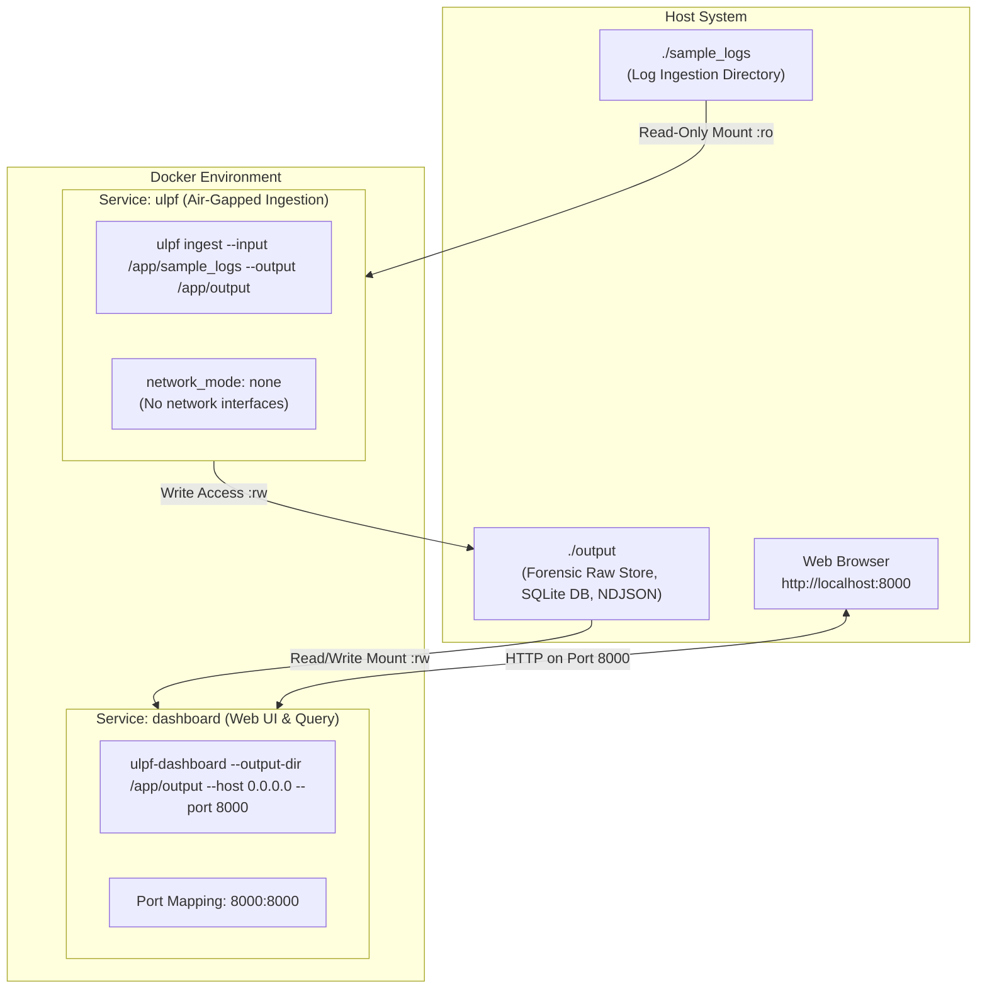
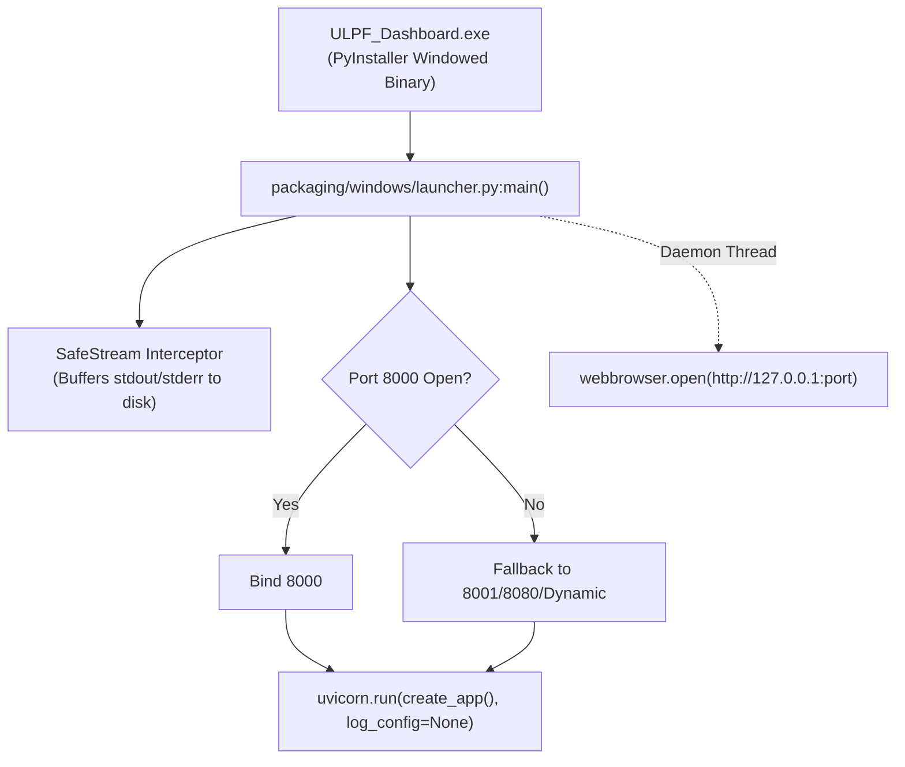

# Deployment Architecture

This document describes the **as-built deployment architecture** of the Universal Log Parsing Framework (ULPF), detailing local execution, desktop packaging, and containerization topologies based strictly on verified repository artifacts.

---

## 1. Verified Deployment Modalities

The repository provides four fully realized deployment modalities:

```text
┌────────────────────────────────────────────────────────────────────────┐
│                        ULPF DEPLOYMENT MODALITIES                      │
├─────────────────┬─────────────────┬──────────────────┬─────────────────┤
│ 1. Local CLI &  │ 2. Desktop      │ 3. Docker        │ 4. Packaged     │
│    Python Run   │    1-Click GUI  │    Containers    │    Binaries     │
│ (ulpf CLI tool) │ (.bat / .sh)    │ (docker-compose) │ (.exe / .dmg)   │
└─────────────────┴─────────────────┴──────────────────┴─────────────────┘
```

---

## 2. Docker Container Deployment

The containerized deployment topology is defined in `docker/Dockerfile` and `docker/docker-compose.yml`.

### 2.1 Container Topology & Security Boundaries



### 2.2 Container Specifications

* **Base Image**: `python:3.11-slim` (multi-stage build in `docker/Dockerfile:1-48`).
* **Security Context**: Runs under non-root user `ulpf` (UID 10001, GID 10001).
* **Air-Gap Hardening**: The `ulpf` ingestion service runs with `network_mode: none`, ensuring zero outbound or inbound network connectivity during log normalization.
* **Volume Mounts**:
  - `./sample_logs:/app/sample_logs:ro` (read-only input source).
  - `./output:/app/output:rw` (shared persistent volume between ingestion and dashboard).
* **Ports Exposed**: `8000:8000` (FastAPI Web UI).

---

## 3. Packaged Native Desktop Deployment

### 3.1 Windows Packaged Executable (`ULPF_Dashboard.exe`)
* **Build Spec**: `packaging/windows/ulpf.spec`.
* **Launcher Wrapper**: `packaging/windows/launcher.py`.
* **GUI Subsystem Adaptation**:
  - In windowed (`noconsole`) PyInstaller mode under `pythonw.exe`, `sys.stdout` and `sys.stderr` are `None`, causing standard logging and `uvicorn` to crash on `isatty()` calls.
  - `launcher.py` installs a custom `SafeStream` interceptor that buffers logs in memory and writes to `%LOCALAPPDATA%\ULPF\ulpf.log`.
  - Configures `uvicorn.run(..., log_config=None)` to avoid terminal stream errors.
  - Automatically negotiates open ports (trying 8000, 8001, 8080, 8888, or dynamic OS ports) to prevent `WinError 10048` (Address already in use).
  - Spawns a background thread that invokes `webbrowser.open(f"http://{host}:{port}")`.



### 3.2 macOS Disk Image (`.dmg`)
* **Build Script**: `build_dmg.sh`.
* **Packaging**: Uses PyInstaller with macOS `.app` bundle structure and `create-dmg` tooling to generate a distributable drag-and-drop disk image containing the standalone executable.

---

## 4. Local CLI & 1-Click Script Execution

### 4.1 1-Click Launchers
* **`Launch_ULPF_Dashboard.bat` / `Run_Dashboard.bat`**: Windows batch scripts detecting active `python.exe` or `py.exe` interpreters, automatically launching `python -m ulpf.cli dashboard --port 8000 --output-dir output`.
* **`start_dashboard.sh`**: Unix POSIX shell wrapper for Linux and macOS environments.
* **`Run_Tests.bat`**: Automated one-click verification script executing `python test_all.py`.

### 4.2 Local CLI Execution Commands
```bash
# 1. Batch file ingestion
python -m ulpf.cli ingest --input sample_logs/ --output output/ --workers 4

# 2. Syslog live listener
python -m ulpf.cli listen --port 1514 --output output/

# 3. Real-time OS process monitor
python -m ulpf.cli monitor --output output/ --interval-ms 250

# 4. Statistical anomaly detection
python -m ulpf.cli analyze --input output/events.ndjson --output output/anomalies.ndjson --emit-features

# 5. Raw payload forensic lookup
python -m ulpf.cli lookup --event-id <uuid> --raw-store output/raw_store

# 6. Web dashboard
python -m ulpf.cli dashboard --port 8000 --output-dir output/
```

---

## 5. Network Ports, Paths & Environment Variables

### 5.1 Network Ports
| Port     | Protocol   | Service / Component         | Purpose                            | Config Flag                      |
| -------- | ---------- | --------------------------- | ---------------------------------- | -------------------------------- |
| **8000** | TCP (HTTP) | FastAPI / Uvicorn Dashboard | Web UI, REST API, SSE Stream       | `--port` / `ULPF_PORT`           |
| **1514** | UDP & TCP  | `SyslogNetworkListener`     | Real-time network syslog ingestion | `--port` / `-p` in `ulpf listen` |

### 5.2 Default Filesystem Layout
```text
output/
├── events.ndjson                 # Canonical normalized UES event stream
├── dead_letter.ndjson            # Quarantined invalid/unparsed events
├── dashboard_index.db            # SQLite search & KPI query acceleration index
├── analytics_baseline.json       # Persisted Welford rolling statistics
├── anomalies.ndjson              # Anomaly-scored event records
├── egress_cef.log                # Re-serialized ArcSight CEF:0 stream
├── egress_leef.log               # Re-serialized IBM QRadar LEEF:2.0 stream
├── kafka_events.ndjson           # Kafka fallback log file
├── parquet_lake/                 # Date and tenant partitioned Parquet lake
│   └── dt=2026-08-30/
│       └── tenant_id=default/
│           └── events.parquet
└── raw_store/                    # 2-tier sharded exact raw byte store
    └── e4/
        └── a1/
            └── e4a1b2c3-4d5e-6f7a-8b9c-0d1e2f3a4b5c.raw
```

### 5.3 Environment Variables
| Variable          | Purpose                                                                                                                            | Default                |
| ----------------- | ---------------------------------------------------------------------------------------------------------------------------------- | ---------------------- |
| `ULPF_API_KEY`    | If set, enforces `X-API-Key` authentication header on mutating endpoints (`/api/reindex`, `/api/ingest/*`, `/api/live-monitor/*`). | None (unauthenticated) |
| `ULPF_OUTPUT_DIR` | Overrides base directory for all forensic, index, and sink outputs.                                                                | `output`               |
| `ULPF_PORT`       | Overrides default HTTP listening port for dashboard.                                                                               | `8000`                 |
| `ULPF_HOST`       | Overrides default listening interface for dashboard.                                                                               | `127.0.0.1`            |
