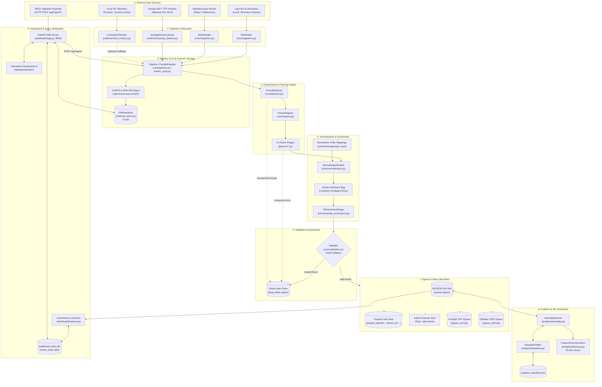

# 01 — Master Repository Architecture

This diagram captures the highest-level architectural subsystems of the Universal Log Parsing Framework (ULPF) and the concrete relationships connecting ingestion, core processing, storage, analytics, querying, and egress.

---

## Architecture Diagram

---

## Evidence

| Component / Relationship | Source File | Symbol / Method | Confidence |
|---|---|---|---|
| Ingestion Readers $\to$ Pipeline | `ulpf/cli.py:173-220` | `ingest()` invoking `FileReader` / `StdinReader` / `_build_pipeline()` | **CONFIRMED** |
| Syslog Listener $\to$ Pipeline | `ulpf/cli.py:283-349`, `ulpf/collectors/syslog_listener.py:46-109` | `SyslogNetworkListener.start()` dispatching to `on_event()` | **CONFIRMED** |
| Pipeline $\to$ RawStore (Pre-Parse) | `ulpf/core/pipeline.py:118-119` | `self.raw_store.put(event_id, raw_bytes)` | **CONFIRMED** |
| Pipeline $\to$ Detector $\to$ Registry $\to$ Parsers | `ulpf/core/pipeline.py:122-132` | `self.detector.detect()`, `get_parser_for_format()` | **CONFIRMED** |
| Parsers $\to$ NormalizationEngine | `ulpf/core/pipeline.py:186` | `self.norm_engine.normalize(extracted, parser.name)` | **CONFIRMED** |
| NormalizationEngine $\to$ Vendor Attributes Bag | `ulpf/core/normalization.py:323-327` | `vendor_attrs[k] = v` for unmapped fields | **CONFIRMED** |
| Pipeline $\to$ IPEnrichmentPlugin | `ulpf/core/pipeline.py:211`, `ulpf/enrichment/ip_enrichment.py:184-209` | `self.enrichment.enrich(ues_event)` | **CONFIRMED** |
| Pipeline $\to$ Validator $\to$ Sinks / DeadLetter | `ulpf/core/pipeline.py:216-240` | `self.validator.validate_and_route()`, `sink.write()` | **CONFIRMED** |
| Sinks Implementation Suite | `ulpf/sinks/` | `NDJSONFileSink`, `ParquetSink`, `KafkaProducerSink`, `CEFEgressSink`, `LEEFEgressSink` | **CONFIRMED** |
| Analytics Subsystem & Features | `ulpf/cli.py:225-281`, `ulpf/analytics/` | `AnomalyDetector.analyze()`, `FeatureVectorExtractor.extract_vector()` | **CONFIRMED** |
| SQLite Indexer $\to$ FastAPI $\to$ UI | `ulpf/dashboard/app.py:159-245`, `ulpf/dashboard/indexer.py:69-120` | `EventIndexer.sync_from_ndjson()`, `EventIndexer.query_events()` | **CONFIRMED** |
