# 02 — Repository Module Map

This document presents the structural module hierarchy of the ULPF repository and visualizes the inter-module dependency graph based on verified Python imports and configuration references.

---

## Module Dependency Graph

```mermaid
flowchart TD
    subgraph CLI_ENTRY["CLI & Launcher Entry Points"]
        CLI["ulpf/cli.py"]
        WIN_LAUNCHER["packaging/windows/launcher.py"]
        DASH_MAIN["ulpf/dashboard/app.py:main"]
    end

    subgraph CORE_PKG["ulpf/core (Orchestration & Base Engine)"]
        CORE_INGEST["ulpf.core.ingestion\n(RawEvent, ReaderBase, FileReader, StdinReader)"]
        CORE_STORE["ulpf.core.raw_store\n(RawStoreBase, FileRawStore)"]
        CORE_DET["ulpf.core.detector\n(FormatDetector)"]
        CORE_REG["ulpf.core.registry\n(register_parser, get_all_parsers)"]
        CORE_NORM["ulpf.core.normalization\n(NormalizationEngine)"]
        CORE_VAL["ulpf.core.validation\n(Validator, _DeadLetterSink)"]
        CORE_PIPE["ulpf.core.pipeline\n(Pipeline)"]
        CORE_POOL["ulpf.core.worker_pool\n(ParallelPipeline, _worker_process)"]
    end

    subgraph PARSERS_PKG["ulpf/parsers (Plugin Suite)"]
        PARSER_BASE["ulpf.parsers.base\n(BaseParser)"]
        PARSER_PLUGINS["ulpf.parsers.*\n(11 format implementations)"]
        PARSER_INIT["ulpf.parsers.__init__\n(pkgutil dynamic discovery)"]
    end

    subgraph SCHEMAS_PKG["ulpf/schemas (Contracts & Mappings)"]
        JSON_SCHEMA["ues_schema.json\n(Draft 7 JSON Schema)"]
        YAML_MAPPINGS["ulpf/schemas/mappings/*.yaml\n(11 YAML Mapping Specs)"]
    end

    subgraph COLLECTORS_PKG["ulpf/collectors (Network & Host Ingestion)"]
        COLL_SYSLOG["ulpf.collectors.syslog_listener\n(SyslogNetworkListener)"]
        COLL_LIVE["ulpf.collectors.live_monitor\n(LiveSystemMonitor)"]
    end

    subgraph ENRICHMENT_PKG["ulpf/enrichment (Context Decoration)"]
        ENRICH_BASE["ulpf.enrichment.base\n(EnrichmentPlugin)"]
        ENRICH_IP["ulpf.enrichment.ip_enrichment\n(IPEnrichmentPlugin)"]
        ENRICH_COMP["ulpf.enrichment.composite\n(CompositeEnrichment)"]
        ENRICH_NOOP["ulpf.enrichment.noop\n(NoOpEnrichment)"]
    end

    subgraph SINKS_PKG["ulpf/sinks (Storage & Egress)"]
        SINK_BASE["ulpf.sinks.base\n(SinkBase)"]
        SINK_NDJSON["ulpf.sinks.ndjson_file\n(NDJSONFileSink)"]
        SINK_PARQUET["ulpf.sinks.parquet_sink\n(ParquetSink)"]
        SINK_KAFKA["ulpf.sinks.kafka_producer\n(KafkaProducerSink)"]
        SINK_KAFKA_STUB["ulpf.sinks.kafka_stub\n(KafkaStubSink)"]
        SINK_CEF["ulpf.sinks.cef_egress\n(CEFEgressSink)"]
        SINK_LEEF["ulpf.sinks.leef_egress\n(LEEFEgressSink)"]
    end

    subgraph ANALYTICS_PKG["ulpf/analytics (ML & Profiling)"]
        ANALYTICS_BASE["ulpf.analytics.baseline\n(RollingStats, BaselineProfiler)"]
        ANALYTICS_ANOM["ulpf.analytics.anomaly\n(AnomalyDetector)"]
        ANALYTICS_FEAT["ulpf.analytics.features\n(FeatureVectorExtractor)"]
    end

    subgraph DASHBOARD_PKG["ulpf/dashboard (Query & UI)"]
        DASH_APP["ulpf.dashboard.app\n(FastAPI ASGI Application)"]
        DASH_IDX["ulpf.dashboard.indexer\n(EventIndexer / SQLite)"]
        DASH_STATIC["ulpf/dashboard/static/\n(HTML5/CSS/JS Single Page App)"]
    end

    %% CLI dependencies
    CLI --> CORE_INGEST & CORE_PIPE & CORE_POOL & CORE_DET & CORE_REG & CORE_NORM & CORE_VAL & CORE_STORE
    CLI --> COLL_SYSLOG & COLL_LIVE & ANALYTICS_ANOM & ANALYTICS_FEAT & DASH_APP & SINKS_PKG
    WIN_LAUNCHER --> DASH_APP
    DASH_MAIN --> DASH_APP

    %% Core dependencies
    CORE_PIPE --> CORE_INGEST & CORE_DET & CORE_REG & CORE_NORM & CORE_VAL & CORE_STORE & ENRICH_BASE & SINK_BASE
    CORE_POOL --> CORE_PIPE
    CORE_DET --> CORE_REG
    CORE_REG --> PARSER_BASE
    CORE_NORM --> YAML_MAPPINGS
    CORE_VAL --> JSON_SCHEMA

    %% Parser dependencies
    PARSER_INIT --> PARSER_PLUGINS
    PARSER_PLUGINS --> PARSER_BASE
    PARSER_PLUGINS --> CORE_REG

    %% Enrichment dependencies
    ENRICH_IP --> ENRICH_BASE
    ENRICH_COMP --> ENRICH_BASE
    ENRICH_NOOP --> ENRICH_BASE

    %% Sinks dependencies
    SINK_NDJSON & SINK_PARQUET & SINK_KAFKA & SINK_KAFKA_STUB & SINK_CEF & SINK_LEEF --> SINK_BASE

    %% Analytics dependencies
    ANALYTICS_ANOM --> ANALYTICS_BASE

    %% Dashboard dependencies
    DASH_APP --> DASH_IDX & CORE_STORE & COLL_LIVE
    DASH_APP --> DASH_STATIC
    DASH_IDX --> CORE_REG
```

---

## Evidence

| Module Dependency | Source File | Import Statement / Mechanism | Confidence |
|---|---|---|---|
| `ulpf.cli` $\to$ `ulpf.core.*` | `ulpf/cli.py:23-29` | `from ulpf.core.detector import ...`, `from ulpf.core.pipeline import ...` | **CONFIRMED** |
| `ulpf.core.pipeline` $\to$ Core Interfaces | `ulpf/core/pipeline.py:19-26` | Imports `ReaderBase`, `FormatDetector`, `RawStoreBase`, `NormalizationEngine`, `Validator`, `EnrichmentPlugin`, `SinkBase` | **CONFIRMED** |
| `ulpf.parsers` $\to$ Dynamic Discovery | `ulpf/parsers/__init__.py:1-15` | `pkgutil.iter_modules(__path__)` auto-importing all `.py` parser files | **CONFIRMED** |
| `ulpf.parsers.*` $\to$ `ulpf.core.registry` | `ulpf/parsers/cef.py:12` | `@register_parser` decorating `CEFParser(BaseParser)` | **CONFIRMED** |
| `ulpf.core.normalization` $\to$ YAML Mappings | `ulpf/core/normalization.py:141-145` | `self.mappings_dir.glob('*.yaml')` | **CONFIRMED** |
| `ulpf.core.validation` $\to$ `ues_schema.json` | `ulpf/core/validation.py:41-43` | `json.load(fh)` compiled via `Draft7Validator` | **CONFIRMED** |
| `ulpf.analytics.anomaly` $\to$ `baseline` | `ulpf/analytics/anomaly.py:24` | `from ulpf.analytics.baseline import BaselineProfiler` | **CONFIRMED** |
| `ulpf.dashboard.app` $\to$ `indexer` & `raw_store` | `ulpf/dashboard/app.py:25-27` | `from ulpf.dashboard.indexer import EventIndexer`, `from ulpf.core.raw_store import FileRawStore` | **CONFIRMED** |
