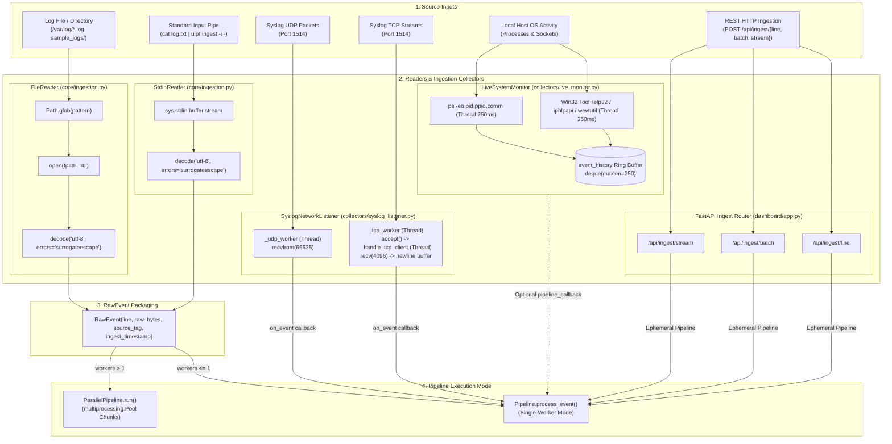

# 04 — Ingestion Architecture

This diagram maps all verified ingestion mechanisms in the ULPF framework and traces how incoming data streams enter the pipeline.

---

## Ingestion Architecture Diagram

---

## Evidence

| Ingestion Mechanism | Source File | Class / Method | Confidence |
|---|---|---|---|
| Binary File Ingestion | `ulpf/core/ingestion.py:46-84` | `FileReader.read()`, opens `rb`, strips `\r\n` | **CONFIRMED** |
| Standard Input Streaming | `ulpf/core/ingestion.py:85-110` | `StdinReader.read()`, reads `sys.stdin.buffer` | **CONFIRMED** |
| Multi-Threaded Syslog UDP | `ulpf/collectors/syslog_listener.py:43-52, 66-78` | `_udp_sock = socket.SOCK_DGRAM`, `_udp_worker` thread | **CONFIRMED** |
| Multi-Threaded Syslog TCP | `ulpf/collectors/syslog_listener.py:54-65, 79-110` | `_tcp_sock = socket.SOCK_STREAM`, `_handle_tcp_client` | **CONFIRMED** |
| Real-time OS Process Monitor | `ulpf/collectors/live_monitor.py:77-128` | `LiveSystemMonitor`, Win32 C APIs & ring buffer | **CONFIRMED** |
| REST Ingest Endpoints | `ulpf/dashboard/app.py:317-380` | `_get_ingest_pipeline()`, `/api/ingest/*` | **CONFIRMED** |
| Multi-Process Worker Pool | `ulpf/core/worker_pool.py:102-179` | `ParallelPipeline.run()`, 500-event chunks | **CONFIRMED** |
