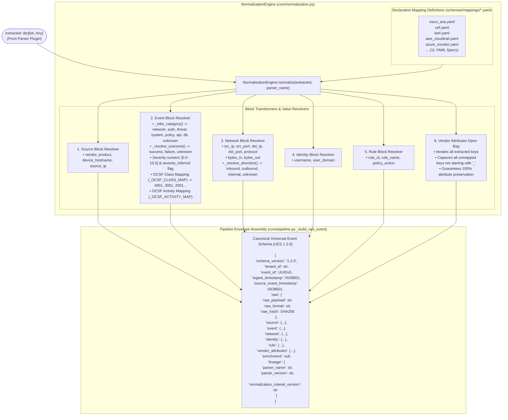

# 06 — Normalization / UES Architecture

This diagram details the declarative normalization pipeline, YAML mapping engine, semantic taxonomy resolution, OCSF crosswalking, and lossless attribute preservation.

---

## Normalization Architecture Diagram

---

## Evidence

| Component / Mapping Rule | Source File | Method / Constant | Confidence |
|---|---|---|---|
| YAML Mapping File Loading | `ulpf/core/normalization.py:141-145` | `self._load_all()` globbing `*.yaml` | **CONFIRMED** |
| Category Inference & Keywords | `ulpf/core/normalization.py:37-62` | `_CATEGORY_KEYWORDS`, `_infer_category()` | **CONFIRMED** |
| Outcome Resolution Map | `ulpf/core/normalization.py:21-35, 64-69` | `_ACTION_OUTCOME_MAP`, `_resolve_outcome()` | **CONFIRMED** |
| Direction Resolution Map | `ulpf/core/normalization.py:71-80` | `_resolve_direction()` checking zone substrings | **CONFIRMED** |
| OCSF Class & Activity Crosswalk | `ulpf/core/normalization.py:102-129, 232-236` | `_OCSF_CLASS_MAP`, `_OCSF_ACTIVITY_MAP` | **CONFIRMED** |
| Vendor Attribute Bag (Lossless) | `ulpf/core/normalization.py:323-327` | `for k, v in extracted.items(): if k not in mapped_keys` | **CONFIRMED** |
| Canonical UES 1.2.0 Builder | `ulpf/core/pipeline.py:50-89` | `Pipeline._build_ues_event()` | **CONFIRMED** |
