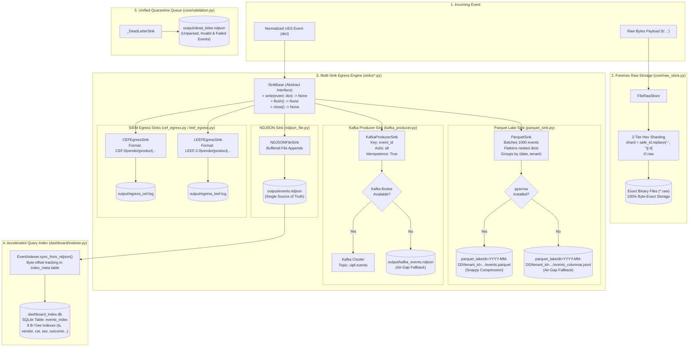

# 07 — Storage & Sink Architecture

This diagram maps all storage layers, forensic raw persistence, egress sinks, and secondary indexing engines in the ULPF repository.

---

## Storage & Sink Architecture Diagram

---

## Evidence

| Storage / Sink Component | Source File | Class / Method | Confidence |
|---|---|---|---|
| Sharded File Raw Store | `ulpf/core/raw_store.py:34-92` | `FileRawStore`, `_path()`, `put()`, `get()` | **CONFIRMED** |
| NDJSON Flat File Sink | `ulpf/sinks/ndjson_file.py:13-39` | `NDJSONFileSink.write()`, `events.ndjson` | **CONFIRMED** |
| Partitioned Parquet Lake & Fallback | `ulpf/sinks/parquet_sink.py:28-134` | `ParquetSink`, `dt=.../tenant_id=...`, `events.parquet` / `events_columnar.jsonl` | **CONFIRMED** |
| Kafka Producer & Fallback | `ulpf/sinks/kafka_producer.py:42-155` | `KafkaProducerSink`, `topic="ulpf.events"`, `kafka_events.ndjson` | **CONFIRMED** |
| ArcSight CEF Egress Formatter | `ulpf/sinks/cef_egress.py:15-64` | `CEFEgressSink.format_event()`, `egress_cef.log` | **CONFIRMED** |
| IBM QRadar LEEF Egress Formatter | `ulpf/sinks/leef_egress.py:14-60` | `LEEFEgressSink.format_event()`, `egress_leef.log` | **CONFIRMED** |
| Incremental SQLite Indexer | `ulpf/dashboard/indexer.py:69-140` | `EventIndexer`, `sync_from_ndjson()`, `last_byte_offset` | **CONFIRMED** |
| Unified Dead-Letter File | `ulpf/core/validation.py:21-50` | `_DeadLetterSink`, `Validator`, `dead_letter.ndjson` | **CONFIRMED** |
