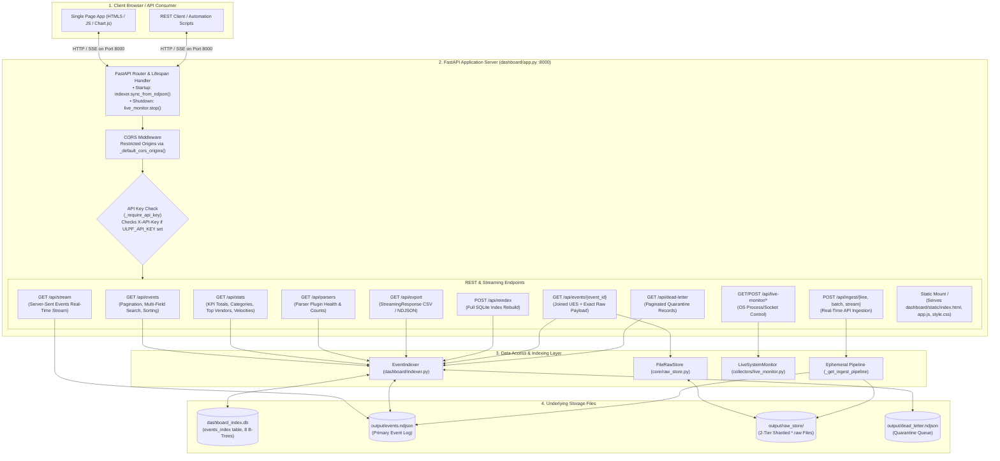

# 08 — Dashboard Architecture

This diagram illustrates the operational dashboard architecture, FastAPI web service, SQLite query acceleration layer, static asset serving, and streaming interfaces.

---

## Dashboard Architecture Diagram

---

## Evidence

| Dashboard Component | Source File | Symbol / Method | Confidence |
|---|---|---|---|
| FastAPI App Factory & Lifespan | `ulpf/dashboard/app.py:150-177` | `create_app()`, `lifespan` handler | **CONFIRMED** |
| CORS & API Key Enforcement | `ulpf/dashboard/app.py:178-192, 137-147` | `CORSMiddleware`, `_require_api_key()` | **CONFIRMED** |
| REST Query Endpoints | `ulpf/dashboard/app.py:200-312` | `/api/events`, `/api/events/{id}`, `/api/stats`, `/api/parsers`, `/api/dead-letter`, `/api/export`, `/api/reindex` | **CONFIRMED** |
| REST Ingestion Pipelines | `ulpf/dashboard/app.py:317-380` | `/api/ingest/line`, `/api/ingest/batch`, `/api/ingest/stream`, `_get_ingest_pipeline()` | **CONFIRMED** |
| Server-Sent Events (SSE) | `ulpf/dashboard/app.py:382-411` | `/api/stream`, `StreamingResponse(event_stream(), media_type="text/event-stream")` | **CONFIRMED** |
| Live Monitor Controller | `ulpf/dashboard/app.py:413-485` | `/api/live-monitor/status`, `/api/live-monitor/start`, `/api/live-monitor/stop`, `/api/live-monitor/events` | **CONFIRMED** |
| SQLite B-Tree Indexed Engine | `ulpf/dashboard/indexer.py:25-66, 142-300` | `CREATE TABLE events_index`, 8 indexes, `query_events()`, `get_stats()` | **CONFIRMED** |
| Static Asset Mount | `ulpf/dashboard/app.py:490-500` | `app.mount("/static", ...)` | **CONFIRMED** |
