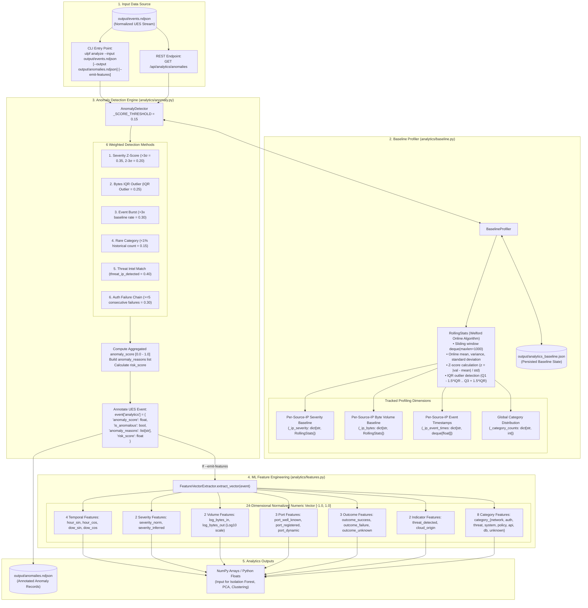

# 09 — Analytics & Machine Learning Architecture

This diagram details the statistical profiling, anomaly detection, rolling baseline maintenance, and 24-dimensional feature extraction subsystems. It explicitly clarifies that analytics executes as an **asynchronous batch / on-demand path**, rather than inline within `Pipeline.process_event()`.

---

## Analytics Subsystem Diagram

---

## Evidence

| Subsystem Component | Source File | Class / Method | Confidence |
|---|---|---|---|
| Welford Online Algorithm | `ulpf/analytics/baseline.py:27-104` | `RollingStats`, `update()`, `z_score()`, `iqr_outlier()` | **CONFIRMED** |
| Multi-Dimensional Profiler | `ulpf/analytics/baseline.py:105-218` | `BaselineProfiler`, `_ip_severity`, `_ip_bytes`, `_ip_event_times`, `analytics_baseline.json` | **CONFIRMED** |
| 6-Method Weighted Scoring | `ulpf/analytics/anomaly.py:29-37, 68-150` | `_SCORE_WEIGHTS`, `AnomalyDetector.analyze()` | **CONFIRMED** |
| Auth Failure Chain Tracker | `ulpf/analytics/anomaly.py:116-128` | `self._auth_failures[src_ip] >= 5` | **CONFIRMED** |
| 24-Dimensional Vectorizer | `ulpf/analytics/features.py:15-104` | `FeatureVectorExtractor.extract_vector()`, `CATEGORIES`, `OUTCOMES` | **CONFIRMED** |
| CLI & REST Analytics Execution | `ulpf/cli.py:225-281`, `ulpf/dashboard/app.py:488` | `ulpf analyze`, `GET /api/analytics/anomalies` | **CONFIRMED** |
