# 10 — Concurrency & Execution Model

This diagram maps all processes, worker pools, background threads, asynchronous event loops, shared buffers, and concurrency boundaries in the ULPF repository.

---

## Concurrency Model Diagram

```mermaid
flowchart TD
    subgraph PROCESS_MAIN["1. Main CLI / Master Process"]
        CLI_MAIN["ulpf CLI / Launcher Process"]
        
        subgraph MAIN_THREADS["Main Process Threads"]
            TH_UDP["Syslog UDP Worker Thread\n(ULPF-Syslog-UDP)\nBlocking recvfrom()"]
            TH_TCP["Syslog TCP Listener Thread\n(ULPF-Syslog-TCP)\nBlocking accept()"]
            TH_CLIENTS["TCP Client Connection Threads\n(_handle_tcp_client per connection)\nBlocking recv() -> line split"]
            TH_LIVE["Live Host Polling Thread\n(LiveSystemMonitor)\nTime sleep(250ms) + threading.Lock"]
            TH_BROWSER["Browser Launcher Daemon Thread\n(webbrowser.open)"]
        end

        SINGLE_PIPELINE["Single-Worker Pipeline Instance\n(Stateless Parsing + Local Counters)"]
    end

    subgraph MULTIPROC_POOL["2. Multi-Process Worker Pool (core/worker_pool.py)"]
        PARALLEL_PIPE["ParallelPipeline Orchestrator\n_chunks(reader, chunk_size=500)"]
        POOL["multiprocessing.Pool(processes=min(cpu_count, 8))\npool.imap_unordered(bound_worker, chunks)"]
        
        subgraph WORKER_PROCS["Worker Processes (Shared-Nothing Architecture)"]
            subgraph W0["Worker Process 0"]
                PIPE0["Isolated Pipeline Instance"]
                VAL0["Isolated Validator"]
                SINK0["Isolated Sinks"]
                PIPE0 --> VAL0 & SINK0
            end

            subgraph W1["Worker Process 1"]
                PIPE1["Isolated Pipeline Instance"]
                VAL1["Isolated Validator"]
                SINK1["Isolated Sinks"]
                PIPE1 --> VAL1 & SINK1
            end

            subgraph WN["Worker Process N"]
                PIPEN["Isolated Pipeline Instance"]
                VALN["Isolated Validator"]
                SINKN["Isolated Sinks"]
                PIPEN --> VALN & SINKN
            end
        end

        PARALLEL_PIPE --> POOL
        POOL --> W0 & W1 & WN
    end

    subgraph ASYNC_SERVER["3. Asynchronous Web Server (dashboard/app.py)"]
        UVICORN["Uvicorn ASGI Server (uvloop / asyncio Event Loop)"]
        FASTAPI_APP["FastAPI Application"]
        
        subgraph ASYNC_TASKS["Async Request Handlers"]
            REQ_GET["async def get_events()"]
            REQ_STREAM["async def event_stream() (SSE)"]
            REQ_REINDEX["async def trigger_reindex()"]
        end

        UVICORN --> FASTAPI_APP --> REQ_GET & REQ_STREAM & REQ_REINDEX
    end

    subgraph BUFFERS_QUEUES["4. Buffers, Locks & Shared State"]
        RING_BUF[("Live Monitor Circular Ring Buffer\ndeque(maxlen=250)\nProtected by threading.Lock")]
        PARQUET_BUF[("Parquet Sink In-Memory Buffer\nlist[dict](batch_size=1000)")]
        SQLITE_LOCK[("SQLite File Database\ncheck_same_thread=False\nWAL Mode / OS File Locks")]
    end

    CLI_MAIN -->|workers <= 1| SINGLE_PIPELINE
    CLI_MAIN -->|ulpf listen| TH_UDP & TH_TCP
    TH_TCP --> TH_CLIENTS
    CLI_MAIN -->|ulpf monitor| TH_LIVE
    TH_LIVE --> RING_BUF
    CLI_MAIN -->|ulpf dashboard| UVICORN & TH_BROWSER
    CLI_MAIN -->|workers > 1| PARALLEL_PIPE

    SINGLE_PIPELINE & W0 & W1 & WN --> PARQUET_BUF
    FASTAPI_APP <--> SQLITE_LOCK
```

---

## Evidence

| Concurrency Mechanism | Source File | Class / Function / Symbol | Confidence |
|---|---|---|---|
| Multi-Process Pool | `ulpf/core/worker_pool.py:102-179` | `multiprocessing.Pool`, `pool.imap_unordered`, `_worker_process()` | **CONFIRMED** |
| Shared-Nothing Worker Instances | `ulpf/core/worker_pool.py:63-97` | `pipeline = pipeline_factory()`, worker closes its own sinks/validator | **CONFIRMED** |
| Syslog UDP/TCP Daemon Threads | `ulpf/collectors/syslog_listener.py:46-65` | `threading.Thread(target=self._udp_worker, daemon=True)`, TCP client threads | **CONFIRMED** |
| Live Monitor Background Thread | `ulpf/collectors/live_monitor.py:97-98, 250-260` | `threading.Thread(target=self._worker, daemon=True)`, `threading.Lock()` | **CONFIRMED** |
| Asynchronous Web Server | `ulpf/dashboard/app.py:159-240, 693-705` | `FastAPI`, `async def` endpoints, `uvicorn.run()` | **CONFIRMED** |
| In-Memory Batch Buffering | `ulpf/sinks/parquet_sink.py:37, 89-93` | `self._buffer: list[dict]`, `len(_buffer) >= self.batch_size` | **CONFIRMED** |
| SQLite Threading Configuration | `ulpf/dashboard/indexer.py:88-90` | `sqlite3.connect(..., check_same_thread=False)` | **CONFIRMED** |
