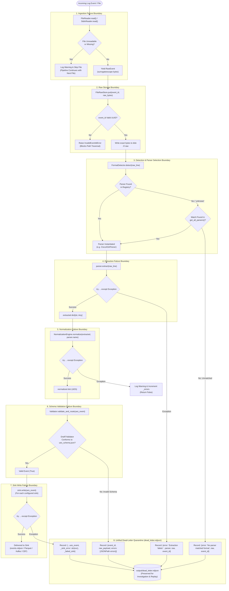

# 11 — Failure Boundaries & Error Flow

This diagram maps every failure boundary, exception catch site, fallback mechanism, and quarantine routing path in the ULPF framework.

---

## Failure Flow Diagram

---

## Evidence

| Failure Boundary | Source File | Exception Handling / Catch Block | Confidence |
|---|---|---|---|
| Invalid UUID Traversal Guard | `ulpf/core/raw_store.py:46-55` | `_validate_event_id()`, raises `InvalidEventIdError` | **CONFIRMED** |
| Unmatched Parser Dead-Letter | `ulpf/core/pipeline.py:134-155` | `if parser is None:` routes to `dead_letter_sink` | **CONFIRMED** |
| Parser Extraction Exception | `ulpf/core/pipeline.py:160-183` | `except Exception as exc:` routes to `dead_letter_sink` | **CONFIRMED** |
| Normalization Exception | `ulpf/core/pipeline.py:187-190` | `except Exception as exc:` logs warning, `_errors += 1` | **CONFIRMED** |
| Schema Validation Quarantine | `ulpf/core/validation.py:59-79` | `validate_and_route()`, writes JSONPath errors to `dead_letter.ndjson` | **CONFIRMED** |
| Sink Write Exception | `ulpf/core/pipeline.py:226-239` | `except Exception as exc:` catches per sink, routes with `_sink_error` | **CONFIRMED** |
| Kafka Broker Degradation | `ulpf/sinks/kafka_producer.py:86-104` | Catches broker exception, falls back to `output/kafka_events.ndjson` | **CONFIRMED** |
| Parquet PyArrow Absence | `ulpf/sinks/parquet_sink.py:123-129` | `if not HAS_PYARROW:` falls back to `events_columnar.jsonl` | **CONFIRMED** |
