# 12 — Deployment & Infrastructure Architecture

This diagram visualizes the four verified deployment environments, packaging mechanisms, container topologies, and network port mappings in the ULPF repository.

---

## Deployment Architecture Diagram

```mermaid
flowchart TD
    subgraph MODES["1. Target Deployment Modalities"]
        M_LOCAL["A. Local Python CLI & Scripts"]
        M_PKG["B. Packaged Native Desktop App"]
        M_DOCKER["C. Containerized Docker Stack"]
        M_NET["D. Network Appliance Integration"]
    end

    subgraph DEPLOY_LOCAL["A. Local Environment"]
        CLI_EXEC["python -m ulpf.cli\n(ingest / listen / analyze / monitor / dashboard)"]
        BATCH_SCRIPTS["Launch_ULPF_Dashboard.bat\nRun_Dashboard.bat\nstart_dashboard.sh\nRun_Tests.bat"]
        LOCAL_DIR[("./sample_logs -> ./output")]
        CLI_EXEC & BATCH_SCRIPTS <--> LOCAL_DIR
    end

    subgraph DEPLOY_PKG["B. Native Packaged Desktop Application"]
        subgraph WINDOWS_EXE["Windows Desktop Binary"]
            PYINSTALLER_WIN["PyInstaller Build (packaging/windows/ulpf.spec)"]
            EXE_BIN["ULPF_Dashboard.exe (noconsole windowed mode)"]
            SAFE_STREAM["SafeStream Interceptor (packaging/windows/launcher.py)\nBuffers stdout/stderr to %LOCALAPPDATA%\\ULPF\\ulpf.log"]
            PORT_NEG["Dynamic Port Fallback Logic (8000 -> 8001 -> 8080 -> Dynamic)"]
            PYINSTALLER_WIN --> EXE_BIN --> SAFE_STREAM --> PORT_NEG
        end

        subgraph MACOS_DMG["macOS Drag-and-Drop DMG"]
            DMG_BUILDER["build_dmg.sh (create-dmg)"]
            APP_BUNDLE["ULPF.app Bundle -> ULPF-Installer.dmg"]
            DMG_BUILDER --> APP_BUNDLE
        end
    end

    subgraph DEPLOY_DOCKER["C. Containerized Air-Gapped Stack (docker/docker-compose.yml)"]
        subgraph HOST_FS["Host Volume Mounts"]
            VOL_LOGS["./sample_logs\n(Read-Only Input)"]
            VOL_OUT["./output\n(Persistent Shared Storage)"]
        end

        subgraph DOCKER_CONTAINERS["Docker Compose Services"]
            subgraph CONT_ULPF["Service: ulpf (docker/Dockerfile)"]
                IMG_ULPF["Image: python:3.11-slim\nNon-root user: ulpf (UID 10001)"]
                CMD_ULPF["CMD: ulpf ingest --input /app/sample_logs --output /app/output"]
                NET_NONE["network_mode: none\n(Strict Air-Gap Isolation)"]
            end

            subgraph CONT_DASH["Service: dashboard"]
                IMG_DASH["Image: python:3.11-slim\nNon-root user: ulpf (UID 10001)"]
                CMD_DASH["CMD: ulpf-dashboard --output-dir /app/output --host 0.0.0.0 --port 8000"]
                PORT_BIND["Port Mapping: 8000:8000"]
            end
        end

        VOL_LOGS -->|:ro mount| CONT_ULPF
        CONT_ULPF -->|:rw write| VOL_OUT
        VOL_OUT -->|:rw mount| CONT_DASH
    end

    subgraph DEPLOY_NET["D. Network Appliance Integration"]
        APPLIANCES["Firewalls, Routers, Linux Servers, Cloud Forwarders"]
        UDP_PORT["UDP Port 1514 (Syslog Network Ingestion)"]
        TCP_PORT["TCP Port 1514 (Syslog Network Ingestion)"]
        APPLIANCES -->|Syslog RFC 3164 / 5424 / CEF / LEEF| UDP_PORT & TCP_PORT
    end

    M_LOCAL --> DEPLOY_LOCAL
    M_PKG --> DEPLOY_PKG
    M_DOCKER --> DEPLOY_DOCKER
    M_NET --> DEPLOY_NET
```

---

## Evidence

| Deployment Target | Source File | Configuration / Script | Confidence |
|---|---|---|---|
| Local Launchers & CLI | `Launch_ULPF_Dashboard.bat`, `start_dashboard.sh`, `ulpf/cli.py` | Command line script entry points | **CONFIRMED** |
| Windows PyInstaller Spec & SafeStream | `packaging/windows/ulpf.spec`, `packaging/windows/launcher.py:27-115` | `SafeStream`, port fallback, `noconsole` launcher | **CONFIRMED** |
| macOS DMG Distribution Script | `build_dmg.sh:1-65` | `create-dmg` packaging script | **CONFIRMED** |
| Multi-Stage Dockerfile | `docker/Dockerfile:1-50` | `FROM python:3.11-slim`, non-root user `ulpf`, entrypoint `["ulpf"]` | **CONFIRMED** |
| Air-Gapped Docker Compose | `docker/docker-compose.yml:1-35` | `network_mode: none`, volume mounts, service port `8000:8000` | **CONFIRMED** |
| Network Syslog Listening Ports | `ulpf/collectors/syslog_listener.py:25-65`, `ulpf/cli.py:283` | Default port 1514 (UDP & TCP) | **CONFIRMED** |
