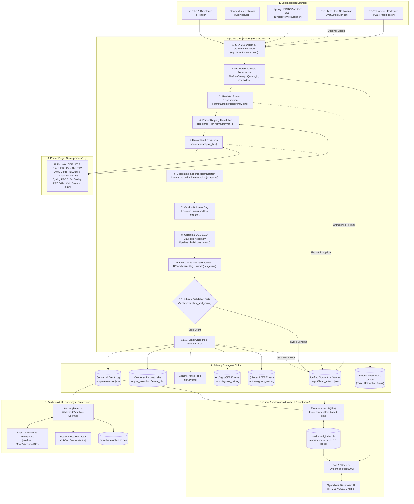

# 13 — Complete System Architecture Map ("How Everything Connects")

This is the **master architectural synthesis** of the entire Universal Log Parsing Framework (ULPF) codebase, mapping all entry points, ingestion paths, parsing engines, normalization rules, forensic storage, validation, sinks, analytics, and operational dashboard subsystems into one comprehensive blueprint.

---

## Master Architecture Map

---

## Evidence

| Subsystem Linkage | Source File | Exact Method / Symbol | Confidence |
|---|---|---|---|
| Ingestion $\to$ Pipeline Orchestration | `ulpf/cli.py:159-349` | `_build_pipeline()`, `pipeline.process_event()`, `ParallelPipeline.run()` | **CONFIRMED** |
| Pre-Parse Forensic Raw Storage | `ulpf/core/pipeline.py:118-119` | `self.raw_store.put(event_id, raw_bytes)` | **CONFIRMED** |
| 11 Dynamic Parser Plugins | `ulpf/core/registry.py:19`, `ulpf/parsers/__init__.py:1-15` | `@register_parser`, `pkgutil.iter_modules()` | **CONFIRMED** |
| Lossless Attribute Preservation | `ulpf/core/normalization.py:323-327` | `vendor_attributes[k] = v` for unmapped extracted keys | **CONFIRMED** |
| Air-Gapped Static IP Enrichment | `ulpf/enrichment/ip_enrichment.py:106-209` | `_classify_ip()`, `IPEnrichmentPlugin.enrich()` | **CONFIRMED** |
| Schema Gate & Quarantine Routing | `ulpf/core/validation.py:59-79` | `Validator.validate_and_route()`, `dead_letter.ndjson` | **CONFIRMED** |
| Multi-Sink Egress Engine | `ulpf/core/pipeline.py:221-240`, `ulpf/sinks/` | `NDJSONFileSink`, `ParquetSink`, `KafkaProducerSink`, `CEFEgressSink`, `LEEFEgressSink` | **CONFIRMED** |
| Statistical Profiling & Anomaly Engine | `ulpf/analytics/baseline.py`, `ulpf/analytics/anomaly.py` | `BaselineProfiler`, `RollingStats`, `AnomalyDetector.analyze()` | **CONFIRMED** |
| 24-Dimensional ML Vectorizer | `ulpf/analytics/features.py:15-104` | `FeatureVectorExtractor.extract_vector()` | **CONFIRMED** |
| Incremental SQLite Indexer & Dashboard | `ulpf/dashboard/indexer.py:103-140`, `ulpf/dashboard/app.py:159-245` | `EventIndexer.sync_from_ndjson()`, `create_app()`, `/api/events` | **CONFIRMED** |
