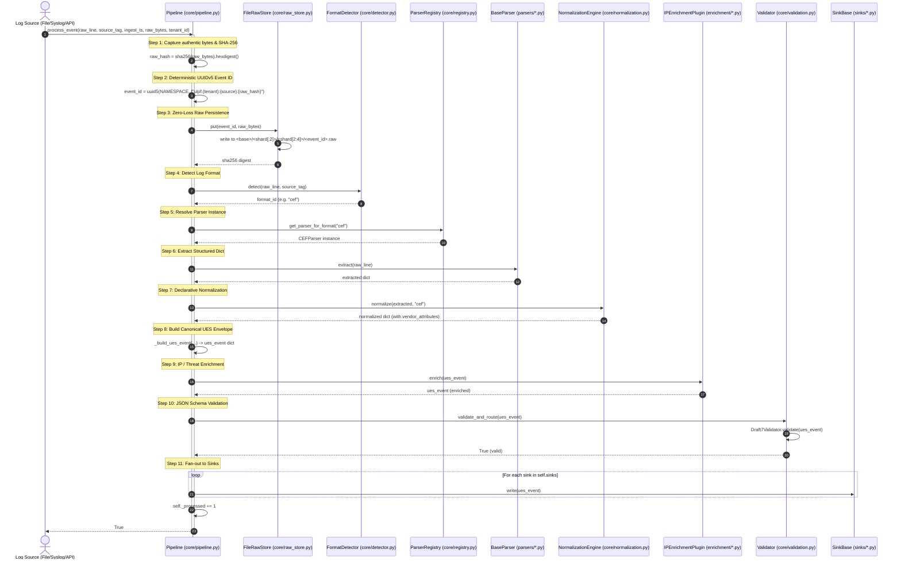
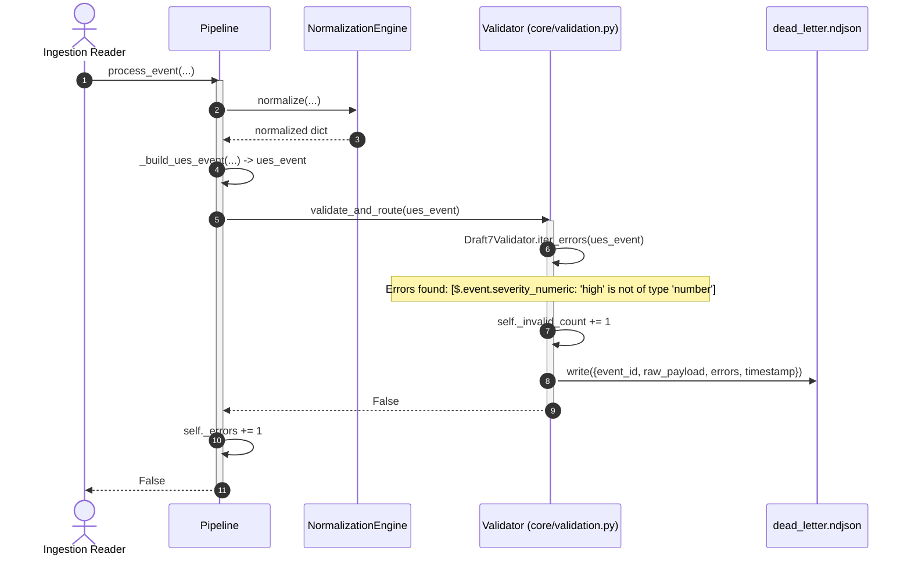
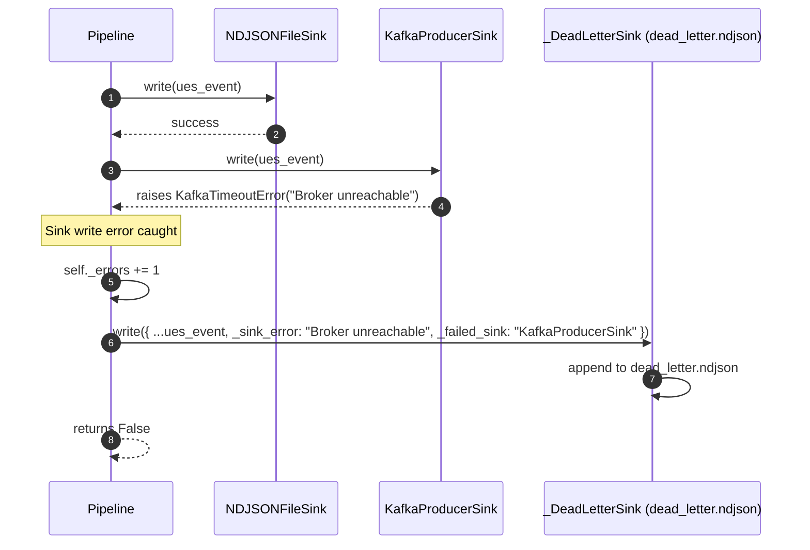
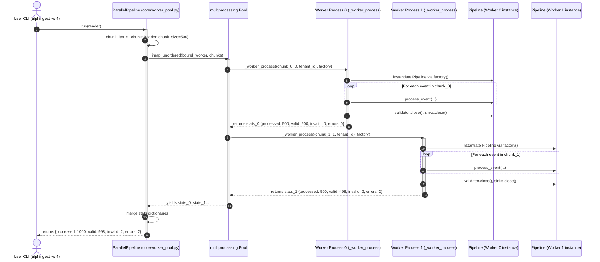

# Event Processing Sequence Diagrams

This document illustrates the exact step-by-step execution sequences for log events traversing the Universal Log Parsing Framework (ULPF), covering happy paths, failure branches, and multi-process concurrency.

---

## 1. Happy-Path Single-Event Sequence

The diagram below details the exact execution path of a valid event through `Pipeline.process_event()`.



---

## 2. Failure Handling & Dead-Letter Sequences

### 2.1 Parser Extraction Failure Sequence

```mermaid
sequenceDiagram
    autonumber
    actor Source as Ingestion Reader
    participant Pipe as Pipeline
    participant Store as FileRawStore
    participant Det as FormatDetector
    participant Parser as BaseParser
    participant DL as _DeadLetterSink (dead_letter.ndjson)

    Source->>Pipe: process_event(raw_line, ...)
    activate Pipe
    Pipe->>Store: put(event_id, raw_bytes)
    Store-->>Pipe: stored

    Pipe->>Det: detect(raw_line)
    Det-->>Pipe: "cisco_asa"

    Pipe->>Parser: extract(raw_line)
    Parser-->>Pipe: raises Exception("Corrupted header tokens")

    Note over Pipe: Exception caught; route to dead-letter
    Pipe->>Pipe: self._errors += 1
    Pipe->>DL: write({schema_version, tenant_id, event_id, ingest_timestamp, raw, error: "Extraction failed: ...", parser: "cisco_asa"})
    DL->>DL: append JSON line to dead_letter.ndjson
    Pipe-->>Source: False
    deactivate Pipe
```

---

### 2.2 Schema Validation Failure Sequence



---

### 2.3 Sink Write Failure & At-Least-Once Delivery Sequence



---

## 3. Multi-Worker Parallel Pipeline Sequence



---

## 4. Canonical Event Lifecycle Table

| Stage | Component | Input | Output | Transformation | Raw Data Preserved? |
|---|---|---|---|---|---|
| **0. Raw Ingest** | `FileReader` / `StdinReader` | OS Stream Bytes | `RawEvent` dataclass | Binary decode with `surrogateescape` | **YES (100%)** |
| **1. Digest & ID** | `Pipeline.process_event` | `RawEvent` | `raw_hash`, `event_id` | SHA-256 calculation & UUIDv5 derivation | **YES** |
| **2. Raw Storage** | `FileRawStore.put` | `(event_id, raw_bytes)` | Disk file path | Sharded binary file write | **YES (100% exact replica)** |
| **3. Format Detection** | `FormatDetector.detect` | `(raw_line, source_tag)` | `format_id: str` | Regex / structure classification | **YES** |
| **4. Parser Extraction** | `BaseParser.extract` | `raw_line: str` | `extracted: dict[str, Any]` | Regex / token splitting / timestamp parsing | **YES** |
| **5. Normalization** | `NormalizationEngine.normalize` | `extracted: dict` | `normalized: dict` | Declarative YAML mapping, category/outcome inference, unmapped keys to `vendor_attributes` | **YES** |
| **6. UES Assembly** | `Pipeline._build_ues_event` | Components dicts | `ues_event: dict` | Standard UES 1.2.0 JSON dictionary assembly | **YES (`raw.raw_payload`)** |
| **7. IP Enrichment** | `IPEnrichmentPlugin.enrich` | `ues_event: dict` | `ues_event: dict` | In-place annotation of `enrichment` block | **YES** |
| **8. Validation Gate** | `Validator.validate_and_route` | `ues_event: dict` | `bool` | JSON Schema Draft 7 validation against `ues_schema.json` | **YES** |
| **9. Sink Fan-out** | `<Sink>.write` | `ues_event: dict` | Destination payload | Format serialization (NDJSON, Parquet, Kafka, CEF, LEEF) | **YES** |
| **10. Indexing** | `EventIndexer.sync_from_ndjson` | `events.ndjson` records | SQLite table row | Relational extraction into `events_index` | **YES (`full_event_json`)** |
