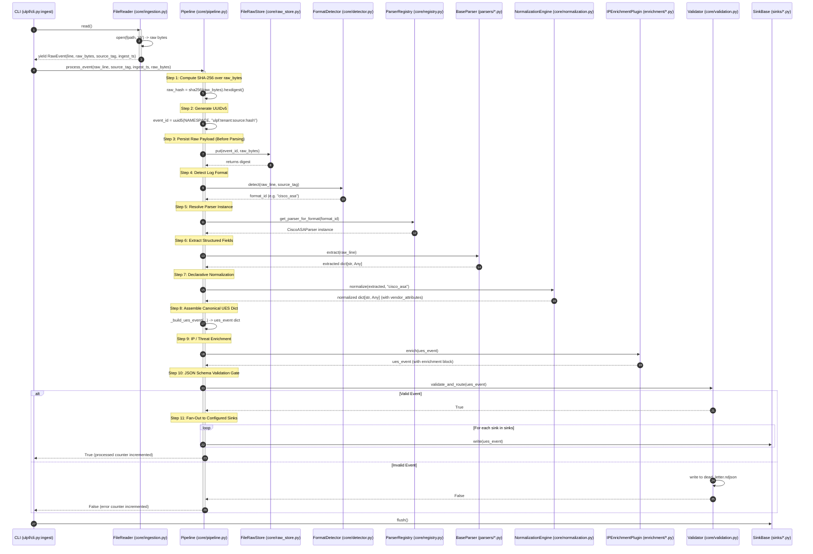
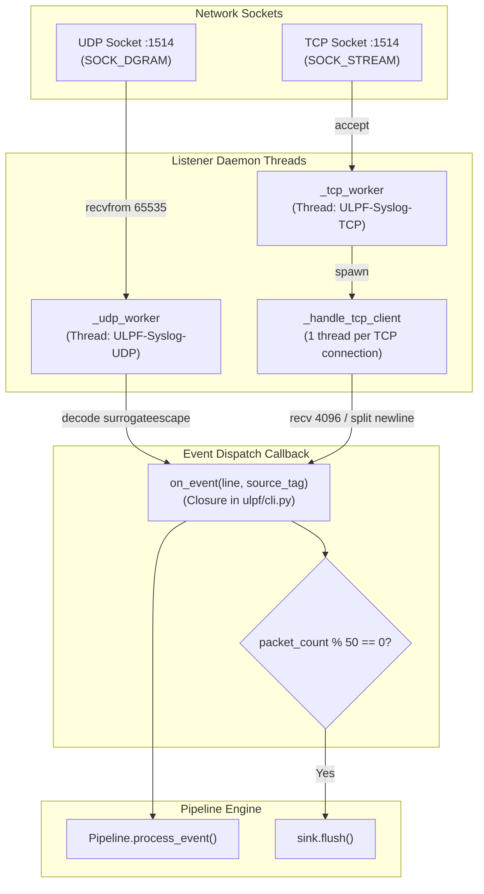
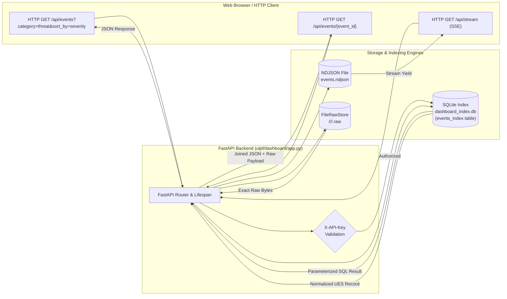
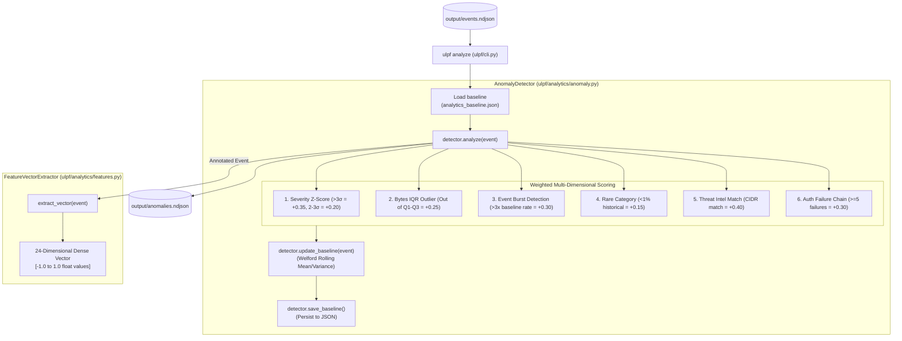

# Runtime Data Flow

This document details the exact **runtime data flow** across all execution paths within the Universal Log Parsing Framework (ULPF), tracing data structures, transformations, and function-to-function transitions from source ingestion to output sinks and user interfaces.

---

## 1. Primary Execution Paths Overview

The framework supports five distinct data intake and processing pipelines:

```text
[A. File/Batch Ingestion]  ──► FileReader  ─────────┐
[B. Stdin Stream Ingest]   ──► StdinReader ─────────┤
[C. Syslog Network Ingest] ──► SyslogListener ──────┼──► Pipeline.process_event() ──► Sinks ──► SQLite Indexer ──► Dashboard UI
[D. REST API Ingestion]    ──► FastAPI /api/ingest ─┤
[E. Live OS Monitoring]    ──► LiveSystemMonitor ───┘ (Internal Buffer + Optional Callback)
```

---

## 2. Deep-Dive Data Flow Traces

### 2.1 File / Batch Ingestion Data Flow



---

### 2.2 Syslog Network Ingestion Data Flow (UDP & TCP)



---

### 2.3 Dashboard Query & REST API Data Flow



---

### 2.4 Analytics & Anomaly Detection Data Flow



---

## 3. Data Transformation & Schema Evolution Matrix

At every point in the pipeline, data transitions through strictly typed objects:

```text
[1. Wire/Disk Bytes]
     │ (b'<134>1 2026-08-30T12:00:00Z firewall %ASA-4-106023: Deny tcp src outside:198.51.100.1...')
     ▼
[2. RawEvent Dataclass]
     │ (line: str, raw_bytes: bytes, source_tag: str, ingest_timestamp: datetime)
     ▼
[3. Extracted Dictionary]
     │ (asa_code: '106023', action: 'deny', protocol: 'tcp', src_ip: '198.51.100.1', ...)
     ▼
[4. Normalized Dictionary]
     │ (source: {...}, event: {...}, network: {...}, identity: null, vendor_attributes: {...})
     ▼
[5. Canonical UES 1.2.0 Dictionary]
     │ (schema_version, tenant_id, event_id, ingest_timestamp, raw, source, event, network, identity, rule, vendor_attributes, lineage, enrichment)
     ▼
[6. Egress Serialization / Database Rows]
     ├── Parquet: Tabular flattened record dictionary
     ├── Kafka / NDJSON: UTF-8 JSON string + newline
     ├── ArcSight CEF: "CEF:0|Cisco|ASA|1.2.0|106023|Deny|5|src=198.51.100.1 ..."
     ├── QRadar LEEF: "LEEF:2.0|Cisco|ASA|1.2.0|106023|\t|src=198.51.100.1 ..."
     └── SQLite: 24-column relational row in events_index table
```

---

## 4. Lossless Data Preservation Verification

The ULPF architecture guarantees complete, non-lossy log preservation across five distinct technical mechanisms:

1. **Pre-Processing Byte Storage**: `FileRawStore.put()` writes the original binary bytes to disk at Step 3, *before* parsing or normalization can throw an error or discard bytes.
2. **Surrogate-Escape String Conversion**: `decode('utf-8', errors='surrogateescape')` preserves unmappable binary bytes in log lines without character replacement corruption (`�`).
3. **Embedded Raw Envelope**: Every UES record includes `raw.raw_payload` (exact log string) and `raw.raw_hash` (SHA-256 hex digest) directly inside the JSON envelope.
4. **Vendor Attributes Open Bag**: In `NormalizationEngine.normalize()`, all key-value pairs extracted by the parser that do not map to canonical UES fields are placed into `vendor_attributes` (lines 323-327).
5. **Exact Retrieval via API & CLI**: Both `ulpf lookup --event-id <uuid>` and `GET /api/events/{event_id}` query `FileRawStore.get()` to return the exact original payload.
