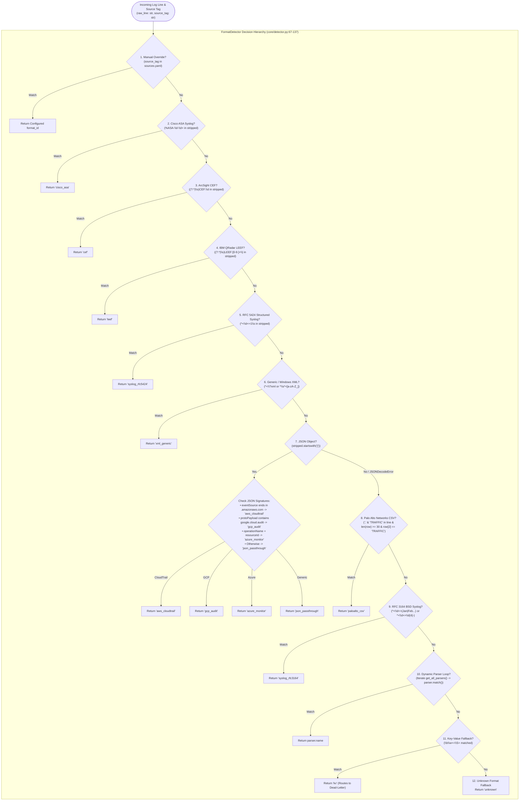

# Format Detection Deep Dive Analysis

This document analyzes the exact heuristic decision tree implemented in `ulpf/core/detector.py`, evaluating classification accuracy, regex ordering, false positives, false negatives, and adversarial input resilience.

---

## 1. Concrete Format Detection Decision Flow

---

## 2. Technical Evaluation of Detection Strengths & Failure Modes

### 2.1 Precedence Integrity (Encapsulation Resolution)
* **Observed Strength**: Cisco ASA messages and CEF/LEEF payloads are frequently encapsulated inside standard syslog envelopes (e.g. `<134>1 2026-08-30... CEF:0|...` or `<166>Aug 15... %ASA-6-106100:...`).
* `FormatDetector` checks `%ASA-`, `CEF:`, and `LEEF:` **before** testing generic RFC 5424 or RFC 3164 regexes. This prevents generic syslog parsers from consuming lines that belong to dedicated perimeter firewall parsers.

### 2.2 Potential False Positives & Conflicts
1. **XML vs. Syslog False Positive Protection**:
   - Generic XML regex `^\s*<[a-zA-Z_]` excludes digits (`\d`), ensuring syslog priority headers like `<134>` or `<38>` are not misclassified as XML tags.
2. **JSON Format Ambiguity**:
   - `json.loads()` is executed inline during detection.
   - If a JSON log contains `eventSource: "s3.amazonaws.com"`, it is routed to `aws_cloudtrail`.
   - If a custom application log happens to include `eventSource: "foo.amazonaws.com"`, it will be misrouted to `aws_cloudtrail` rather than `json_passthrough`.
3. **Key-Value Fallback Dead-Letter Hole**:
   - Step 11 matches `\b\w+=\S+` and returns format ID `'kv'`.
   - However, the repository contains no registered parser named `'kv'`.
   - In `Pipeline.process_event()`, `get_parser_for_format('kv')` returns `None`, causing all KV fallback logs to land directly in `dead_letter.ndjson`.

### 2.3 Performance & ReDoS (Regular Expression Denial of Service)
* All detection regexes (`_ASA_RE`, `_CEF_RE`, `_LEEF_RE`, `_RFC5424_RE`, `_RFC3164_RE`, `_KV_RE`) are pre-compiled module-level single-pass patterns with bounded anchors (`^` or `(?:^|\s)`).
* None contain nested unbounded quantifiers (`(a+)+`), ensuring $O(N)$ linear matching speed and zero vulnerability to catastrophic backtracking.
