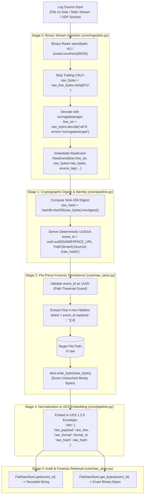

# 01 — Raw Event Lifecycle Diagram

This diagram traces the exact byte-level transformation, cryptographic hashing, sharded disk storage, and UES envelope packaging of raw log events.

---

## Raw Event Lifecycle Diagram

---

## Evidence

| Processing Step | Source File | Exact Symbol / Line | Confidence |
|---|---|---|---|
| Binary Capture & Surrogateescape | `ulpf/core/ingestion.py:72-82` | `FileReader.read()`, `errors='surrogateescape'` | **CONFIRMED** |
| Pre-Parse SHA-256 & UUIDv5 | `ulpf/core/pipeline.py:113-116` | `hashlib.sha256()`, `uuid.uuid5()` | **CONFIRMED** |
| 2-Tier Sharded Disk Storage | `ulpf/core/raw_store.py:61-75` | `FileRawStore._path()`, `dest.write_bytes()` | **CONFIRMED** |
| UES Raw Block Assembly | `ulpf/core/pipeline.py:72-76` | `_build_ues_event()`, `'raw'` container | **CONFIRMED** |
| Exact Byte Retrieval | `ulpf/core/raw_store.py:83-92` | `FileRawStore.get_bytes()` | **CONFIRMED** |
