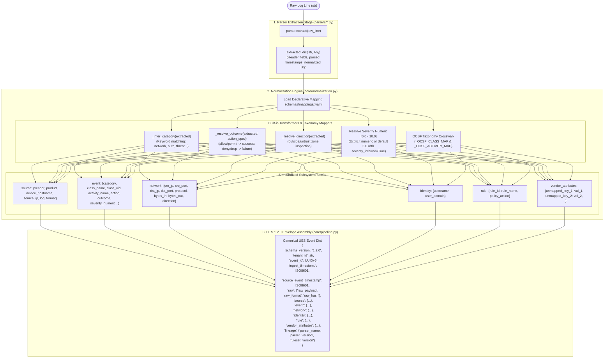

# 03 — Parser & Normalization Flow Diagram

This diagram visualizes the transition from parser token extraction through declarative YAML mapping transformation into canonical Universal Event Schema records.

---

## Parser to Normalization Data Flow

---

## Evidence

| Processing Step                   | Source File                          | Method / Constant                                        | Confidence    |
| --------------------------------- | ------------------------------------ | -------------------------------------------------------- | ------------- |
| Parser Extraction Call            | `ulpf/core/pipeline.py:159`          | `extracted = parser.extract(raw_line)`                   | **CONFIRMED** |
| Declarative YAML Mapping          | `ulpf/core/normalization.py:153-156` | `mapping = self._get_mapping(parser_name)`               | **CONFIRMED** |
| Category Keyword Inference        | `ulpf/core/normalization.py:46-62`   | `_infer_category()`, `_CATEGORY_KEYWORDS`                | **CONFIRMED** |
| Action-to-Outcome Mapping         | `ulpf/core/normalization.py:64-69`   | `_resolve_outcome()`, `_ACTION_OUTCOME_MAP`              | **CONFIRMED** |
| OCSF Class & Activity Crosswalk   | `ulpf/core/normalization.py:102-129` | `_OCSF_CLASS_MAP`, `_OCSF_ACTIVITY_MAP`                  | **CONFIRMED** |
| Lossless Attribute Bag Collection | `ulpf/core/normalization.py:323-327` | `for k, v in extracted.items(): if k not in mapped_keys` | **CONFIRMED** |
| UES Dictionary Assembly           | `ulpf/core/pipeline.py:50-89`        | `_build_ues_event()`                                     | **CONFIRMED** |
