# 04 — Universal Event Schema (UES) Data Model Diagram

This diagram represents the structural entity-relationship and block model of the Universal Event Schema (UES version 1.2.0).

---

## UES 1.2.0 Data Model Diagram

```mermaid
classDiagram
    class UniversalEventSchema {
        +string schema_version
        +string tenant_id
        +string event_id
        +string ingest_timestamp
        +string source_event_timestamp
    }

    class RawContainer {
        +string raw_payload
        +string raw_format
        +string raw_hash
    }

    class SourceBlock {
        +string vendor
        +string product
        +string device_hostname
        +string source_ip
        +string log_format
    }

    class EventBlock {
        +string category
        +string class_name
        +int class_uid
        +string activity_name
        +int activity_id
        +string action
        +string outcome
        +float severity_numeric
        +string severity_original
        +bool severity_inferred
        +string event_type_vendor_specific
    }

    class NetworkBlock {
        +string src_ip
        +int src_port
        +string dst_ip
        +int dst_port
        +string protocol
        +int bytes_in
        +int bytes_out
        +string direction
        +string interface
    }

    class IdentityBlock {
        +string username
        +string user_domain
    }

    class RuleBlock {
        +string rule_id
        +string rule_name
        +string policy_action
    }

    class VendorAttributesBag {
        +dict open_custom_fields
    }

    class EnrichmentBlock {
        +bool threat_ip_detected
        +dict src_ip_context
        +dict dst_ip_context
    }

    class AnalyticsBlock {
        +float anomaly_score
        +list anomaly_reasons
        +bool is_anomalous
        +float risk_score
    }

    class LineageBlock {
        +string parser_name
        +string parser_version
        +string normalization_ruleset_version
    }

    UniversalEventSchema *-- RawContainer : raw (required)
    UniversalEventSchema *-- SourceBlock : source (required)
    UniversalEventSchema *-- EventBlock : event (required)
    UniversalEventSchema o-- NetworkBlock : network (optional/nullable)
    UniversalEventSchema o-- IdentityBlock : identity (optional/nullable)
    UniversalEventSchema o-- RuleBlock : rule (optional/nullable)
    UniversalEventSchema o-- VendorAttributesBag : vendor_attributes (open bag)
    UniversalEventSchema o-- EnrichmentBlock : enrichment (optional/nullable)
    UniversalEventSchema o-- AnalyticsBlock : analytics (optional/nullable)
    UniversalEventSchema *-- LineageBlock : lineage (required)
```

---

## Evidence

| Schema Block | Source File | JSON Schema Definition | Confidence |
|---|---|---|---|
| Required Top-Level Keys | `ulpf/schemas/ues_schema.json:6` | `required: ["event_id", "ingest_timestamp", "raw", "source", "event", "lineage"]` | **CONFIRMED** |
| Raw Container | `ulpf/schemas/ues_schema.json:14-23` | `required: ["raw_payload", "raw_format", "raw_hash"]` | **CONFIRMED** |
| Source Block | `ulpf/schemas/ues_schema.json:24-35` | `required: ["log_format"]` | **CONFIRMED** |
| Event & OCSF Taxonomy | `ulpf/schemas/ues_schema.json:36-56` | `category enum`, `class_uid`, `severity_numeric [0..10]` | **CONFIRMED** |
| Network 5-Tuple | `ulpf/schemas/ues_schema.json:57-74` | `src_ip`, `dst_ip`, `direction enum` | **CONFIRMED** |
| Lineage Provenance | `ulpf/schemas/ues_schema.json:141-150` | `parser_name`, `parser_version`, `normalization_ruleset_version` | **CONFIRMED** |
