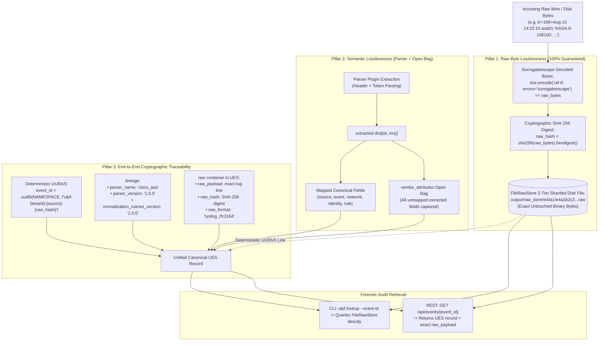

# 05 — Losslessness & Traceability Map

This diagram maps the three technical pillars of losslessness and the end-to-end cryptographic traceability chain in ULPF.

---

## Losslessness & Traceability Map

---

## Evidence

| Pillar / Mechanism | Source File | Method / Line | Confidence |
|---|---|---|---|
| Binary Raw Retention | `ulpf/core/raw_store.py:64-75` | `FileRawStore.put(event_id, raw_bytes)` | **CONFIRMED** |
| Lossless Attribute Open Bag | `ulpf/core/normalization.py:323-327` | `vendor_attributes[k] = v` for unmapped extracted keys | **CONFIRMED** |
| Deterministic UUIDv5 Traceability | `ulpf/core/pipeline.py:116` | `uuid.uuid5(uuid.NAMESPACE_URL, f"ulpf:{tenant}:{source}:{raw_hash}")` | **CONFIRMED** |
| Forensic CLI & API Lookup | `ulpf/cli.py:351-363`, `ulpf/dashboard/app.py:237-262` | `store.get(event_id)`, `get_event_detail()` | **CONFIRMED** |
