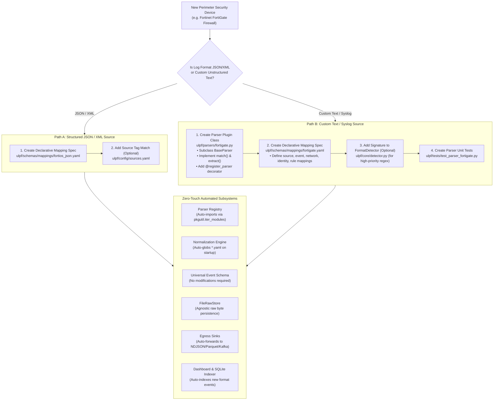

# 06 — Plug-and-Play Log Source Onboarding Flow

This diagram illustrates the step-by-step developer and administrator workflow for onboarding a new log source into the ULPF framework.

---

## Source Onboarding Workflow Diagram

---

## Evidence

| Onboarding Stage | Source File | Mechanism / Architecture | Confidence |
|---|---|---|---|
| Dynamic Parser Auto-Import | `ulpf/parsers/__init__.py:1-15` | `pkgutil.iter_modules(__path__)` imports all `.py` modules | **CONFIRMED** |
| Registry Decorator | `ulpf/core/registry.py:19-23` | `@register_parser` registers parser class | **CONFIRMED** |
| Dynamic Mapping Globbing | `ulpf/core/normalization.py:141-145` | `self.mappings_dir.glob('*.yaml')` | **CONFIRMED** |
| Schema Extensibility | `ulpf/schemas/ues_schema.json:92-95` | `vendor_attributes` captures unmapped keys without schema edits | **CONFIRMED** |
