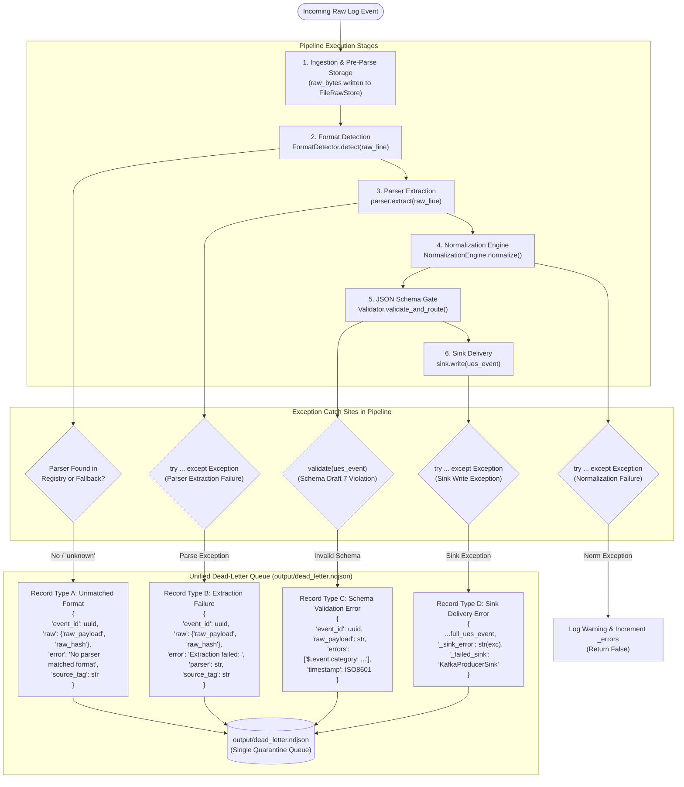

# 07 — Malformed Event & Quarantine Routing Diagram

This diagram visualizes how malformed bytes, extraction exceptions, schema validation violations, and sink errors are contained and routed to the unified dead-letter quarantine queue.

---

## Malformed Event Routing Diagram

---

## Evidence

| Failure Catch Site | Source File | Line / Handler | Confidence |
|---|---|---|---|
| Unmatched Parser Dead-Letter | `ulpf/core/pipeline.py:134-155` | `dead_letter_sink.write(dead_letter_record)` | **CONFIRMED** |
| Parser Extraction Exception | `ulpf/core/pipeline.py:160-183` | `except Exception as exc:` routes to `dead_letter_sink` | **CONFIRMED** |
| Schema Validation Error Record | `ulpf/core/validation.py:68-78` | `Validator.validate_and_route()`, writes `dl_record` | **CONFIRMED** |
| Sink Write Failure Catch | `ulpf/core/pipeline.py:226-239` | `except Exception as exc:` appends `_sink_error` | **CONFIRMED** |
| Unified Dead-Letter File Handle | `ulpf/core/validation.py:44-47` | `_dl_fh = open(self.dead_letter_path, 'a', ...)` | **CONFIRMED** |
