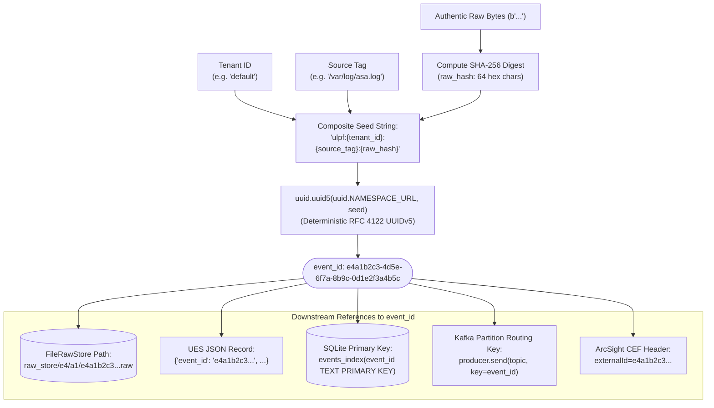

# Event Identity & Traceability Analysis

This document evaluates the mathematical foundation, uniqueness properties, collision resistance, and cross-system correlation of event identifiers in ULPF.

---

## 1. Event Identity Derivation Mechanics

In `ulpf/core/pipeline.py:113-116`, every event's `event_id` is computed deterministically:

```python
# 1. Capture authentic raw bytes & compute SHA-256 immediately
if raw_bytes is None:
    raw_bytes = raw_line.encode('utf-8', errors='surrogateescape')
raw_hash = hashlib.sha256(raw_bytes).hexdigest()

# 2. Deterministic UUIDv5 event ID for idempotent processing
event_id = str(uuid.uuid5(uuid.NAMESPACE_URL, f"ulpf:{tenant_id}:{source_tag}:{raw_hash}"))
```

### Identity Lineage & Linkage Map



---

## 2. Mathematical Properties & Behavioral Analysis

### 2.1 Determinism & Idempotent Reprocessing
* Because UUIDv5 uses SHA-1 hashing over a fixed namespace (`uuid.NAMESPACE_URL`) and seed string, **reprocessing the identical log file, stream, or batch produces the exact same `event_id` every single time**.
* **Impact on Replays & Retries**:
  - Re-ingesting a log file overwrites the identical path in `FileRawStore` without creating duplicate dangling files.
  - In SQLite (`dashboard_index.db`), `INSERT OR REPLACE` / `PRIMARY KEY` constraints prevent duplicate rows from corrupting historical statistics.
  - In Kafka, producing with `key=event_id` and `enable_idempotence=True` guarantees exactly-once partition semantics.

### 2.2 Collision Probability Analysis
* The seed string contains a 256-bit cryptographic digest (`raw_hash = sha256(raw_bytes)`), combined with logical tenant and source identifiers.
* UUIDv5 maps this into a 128-bit space (with 122 bits of entropy).
* Collision probability in a dataset of $N = 10^9$ (one billion) logs is approximately $P \approx \frac{N^2}{2 \times 2^{122}} \approx \frac{10^{18}}{1.06 \times 10^{37}} \approx 10^{-19}$ (effectively zero).

### 2.3 Cross-Worker & Cross-Execution Consistency
* `ParallelPipeline` distributes raw events across multiple CPU worker processes.
* Because `event_id` derivation requires no shared state, global locks, or database sequences, independent workers generate identical UUIDs for duplicate log lines across chunk boundaries.
