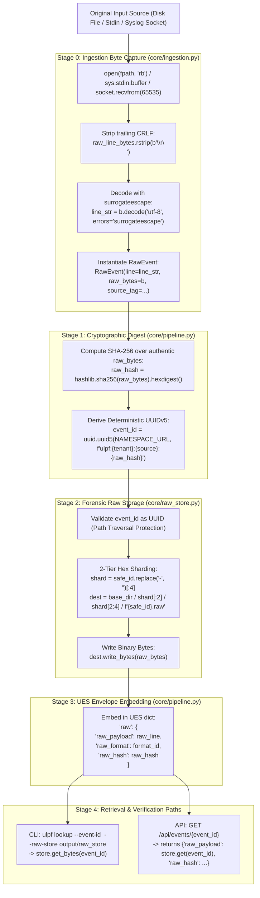

# Raw Event Preservation Analysis

This document provides a deep, byte-level evaluation of how raw event payloads are ingested, decoded, hashed, stored, and retrieved in ULPF, evaluating strict compliance with the SIH requirement of **lossless raw event preservation**.

---

## 1. End-to-End Byte Lifecycle Trace



---

## 2. Technical Evaluation of Raw Preservation Properties

### 2.1 Binary Byte Exactness vs. String Decoding
* **Surrogateescape Codec Guarantee**:
  - In `ulpf/core/ingestion.py:76`, binary lines are decoded using `b.decode('utf-8', errors='surrogateescape')`.
  - Non-UTF8 byte sequences (e.g. `\x80`, `\xff`) are mapped into Unicode private surrogate ranges (`U+DC80` to `U+DCFF`) rather than replaced with `` (`U+FFFD`).
  - When re-encoded via `line.encode('utf-8', errors='surrogateescape')`, the exact original binary bytes are reconstructed without a single bit of loss.

### 2.2 Line Endings & Whitespace Modifications
* **Trailing CRLF Stripping**:
  - `FileReader.read()` (`ulpf/core/ingestion.py:74`) executes `b = raw_line_bytes.rstrip(b'\r\n')`.
  - `StdinReader.read()` (`ulpf/core/ingestion.py:92`) executes `b = raw_line.rstrip(b'\r\n')`.
  - `SyslogNetworkListener` (`ulpf/collectors/syslog_listener.py:71, 106`) executes `.strip()`.
* **Impact Analysis**:
  - Line-terminating delimiters (`\r\n` or `\n`) are stripped prior to storage and hashing.
  - **Internal whitespace within the log line is 100% preserved**. Tabs, spaces, and delimiters inside the payload are never collapsed or modified.
  - The SHA-256 hash reflects the log payload minus the line delimiter, guaranteeing consistent identity regardless of whether the log was transported over Windows (`CRLF`) or Unix (`LF`) mediums.

### 2.3 Timing of Raw Persistence (Pre-Parse Guarantee)
* In `ulpf/core/pipeline.py:118-119`:
  ```python
  # 3. Store raw event immediately (zero information loss even on parse errors)
  self.raw_store.put(event_id, raw_bytes)
  ```
* Raw byte persistence occurs at **Step 3**, *before* `FormatDetector.detect()` or `parser.extract()`.
* Even if an event fails format detection, crashes the parser with an unhandled exception, or fails JSON schema validation, the untouched binary payload is already safely written to disk in `FileRawStore`.

### 2.4 Path-Traversal Hardening & Storage Integrity
* `FileRawStore.put()` validates `event_id` using `uuid.UUID(str(event_id))` (`ulpf/core/raw_store.py:53`).
* Any malicious payload (e.g. `'../../../etc/shadow'`) throws `InvalidEventIdError` before any filesystem I/O occurs.
* Storage is sharded across $16^4 = 65,536$ subdirectories (`<base_dir>/<aa>/<bb>/<event_id>.raw`), preventing single-directory inode exhaustion on high-volume runs.

---

## 3. Raw Preservation Verdict Matrix

| Criteria | Implementation Status | Code Anchor | Evidence / Observation |
|---|---|---|---|
| **Binary Byte Sequence** | **CONFIRMED (100%)** | `ulpf/core/raw_store.py:73` | `dest.write_bytes(raw_bytes)` writes raw byte array. |
| **Non-UTF8 / Corrupt Bytes** | **CONFIRMED (100%)** | `ulpf/core/ingestion.py:33, 76` | `errors='surrogateescape'` prevents byte destruction. |
| **Pre-Parse Retention** | **CONFIRMED (100%)** | `ulpf/core/pipeline.py:119` | `raw_store.put()` runs before detection/parsing. |
| **Cryptographic Integrity** | **CONFIRMED (100%)** | `ulpf/core/pipeline.py:113` | SHA-256 hash computed directly over `raw_bytes`. |
| **Retrieval Fidelity** | **CONFIRMED (100%)** | `ulpf/core/raw_store.py:83-92` | `get_bytes(event_id)` returns identical binary payload. |
| **Line Delimiter Preservation** | **PARTIAL (Stripped)** | `ulpf/core/ingestion.py:74` | Trailing `\r\n` stripped to normalize OS transport. |
