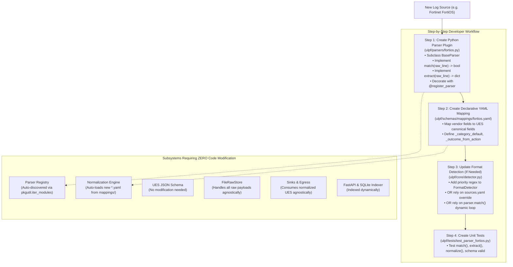

# Plug-and-Play Log Source Onboarding Analysis

This document provides a code-grounded architectural walkthrough of onboarding a new log source into ULPF, evaluating the SIH requirement for **plug-and-play onboarding** with minimal code modification.

---

## 1. Concrete Walkthrough: Onboarding a New Firewall Vendor (Fortinet FortiOS)

Suppose an enterprise introduces **Fortinet FortiGate** firewall logs formatted as:
```text
<189>date=2026-08-30 time=14:22:10 devname="FGT60D" devid="FGT60D4614041234" logid="0000000013" type="traffic" subtype="forward" level="notice" vd="root" srcip=192.168.1.110 srcport=54231 srcintf="port1" dstip=198.51.100.25 dstport=443 dstintf="port2" proto=6 action="accept" policyid=1
```

Let's trace the exact steps and code changes required to onboard this new format:



---

## 2. Granular Change Boundary Breakdown

| Onboarding Step | Files Touched | Nature of Modification | Developer Skill Required | Application Redeployment Needed? |
|---|---|---|---|---|
| **1. Parser Implementation** | `ulpf/parsers/<name>.py` (New file) | **Python Code (New Class)**: Inherits `BaseParser`, regex/token splitting, `@register_parser`. | Python developer | Yes (Restart process / Container reload) |
| **2. Normalization Rules** | `ulpf/schemas/mappings/<name>.yaml` (New file) | **Declarative YAML (No Code)**: Defines field assignments and transformation hints. | System Administrator / Analyst | No (Loaded dynamically on initialization) |
| **3. Source Override (Optional)** | `ulpf/config/sources.yaml` (Edit file) | **YAML Config**: Sets `source_tag: <prefix>` -> `format: <name>`. | System Administrator | No |
| **4. Core Pipeline Engine** | `ulpf/core/pipeline.py` | **ZERO CHANGES REQUIRED** | None | N/A |
| **5. Storage & Sinks** | `ulpf/sinks/*`, `ulpf/core/raw_store.py` | **ZERO CHANGES REQUIRED** | None | N/A |
| **6. Dashboard & Indexer** | `ulpf/dashboard/*` | **ZERO CHANGES REQUIRED** | None | N/A |
| **7. Schema Definition** | `ulpf/schemas/ues_schema.json` | **ZERO CHANGES REQUIRED** | None | N/A |

---

## 3. Plug-and-Play Architecture Evaluation

### 3.1 Strengths:
1. **Open-Closed Principle (OCP)**: Core pipeline orchestrator (`Pipeline`), validator (`Validator`), storage (`FileRawStore`), sinks (`SinkBase`), and indexing (`EventIndexer`) are closed for modification but open for extension.
2. **Auto-Discovery via `pkgutil`**: Dropping a new `.py` file into `ulpf/parsers/` decorated with `@register_parser` automatically registers the class on framework startup without modifying `ulpf/parsers/__init__.py` or `ulpf/core/registry.py`.
3. **Dynamic YAML Loading**: `NormalizationEngine` globs `ulpf/schemas/mappings/*.yaml` on startup.

### 3.2 Current Limitations:
1. **Pure Configuration-Only Onboarding is Partial**:
   - While `JSONPassthroughParser` and `XMLGenericParser` allow onboarding structured JSON and XML by adding only a YAML mapping, **unstructured or non-standard text formats still require writing a Python parser class**.
   - There is currently no generic user-facing Grok or regular-expression builder allowing non-programmers to define parsers via GUI or YAML alone.
