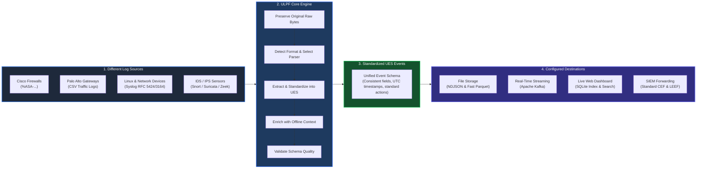

# Diagram 01: The Big Picture of ULPF

> A simple, 30-second overview of what ULPF is, what problem it solves, and how it fits into a modern security environment.

---

## The System at a Glance

When security devices generate logs, every vendor formats their messages differently. **ULPF (Universal Log Pre-processing Framework)** sits between those messy log sources and the systems that need clean, standardized data:



---

## What Does Each Part Do?

### 1. Different Log Sources
Every piece of security hardware and software speaks its own language. A Cisco firewall formats messages with special `%ASA` codes, a Palo Alto appliance outputs comma-separated values, and Linux servers send Syslog text. ULPF accepts logs from all of these sources through files, standard terminal input (`stdin`), live network sockets, or web API requests.

### 2. The ULPF Core Engine
ULPF acts as the central processing workshop. When a raw log arrives, ULPF performs five essential jobs:
* **Preserves the raw evidence**: Saves an exact, unaltered copy of the original bytes to disk and computes its cryptographic SHA-256 fingerprint.
* **Identifies the format**: Automatically detects which vendor or protocol created the log.
* **Parses the text**: Extracts the raw data into structured fields.
* **Normalizes into UES**: Converts vendor-specific names into our shared, universal standard.
* **Enriches and validates**: Adds offline IP context (like identifying cloud providers or private networks) and guarantees the event matches strict quality rules.

### 3. Standardized Events (UES)
Instead of dealing with hundreds of different vendor structures, downstream tools receive events formatted in the **Unified Event Schema (UES)**. In UES:
* Every event has a predictable structure (`network`, `source`, `event`, `identity`, `enrichment`).
* Timestamps are always normalized to standard ISO-8601 UTC.
* Actions are converted to clear universal values like `allowed` or `blocked`.
* Nothing is lost: vendor-specific data that doesn't fit standard fields is preserved in `vendor_attributes`.

### 4. Configured Destinations (Sinks)
Once an event is clean and validated, ULPF delivers it wherever it is needed:
* **Long-term storage**: Saved into line-delimited JSON (`NDJSON`) or compressed columnar files (`Parquet`) for fast queries.
* **Real-time streams**: Published to message queues like **Apache Kafka** for downstream processing pipelines.
* **Live operations**: Indexed into a local database so security analysts can search, filter, and inspect events in real time using the **ULPF Web Dashboard**.
* **Legacy SIEM integration**: Re-formatted into standard CEF or LEEF streams to feed traditional security platforms.

---

## Why Did We Build ULPF?

The easiest way to understand ULPF is through this simple chain:

```text
The Problem:
Every security vendor writes logs in a different format with different field names. 
Writing detection rules or search queries across multiple firewall brands requires 
building custom logic for every single device type.

Our Decision:
Handle the entire burden of parsing, raw evidence preservation, and normalization 
in a dedicated, high-performance pre-processing engine before logs reach storage.

The Result:
Downstream systems, analysts, and automated detection tools only have to work with 
ONE clean, reliable, and standardized event schema (UES).
```

---

## Think of It Like This

> **Think of ULPF as a universal translator at an international conference.**

If you have delegates speaking English, Spanish, Japanese, and French, you could hire dozens of individual translators so everyone can talk to everyone else. Or, you can have every delegate speak to one central translator who converts everything into a single shared language.

ULPF is that central translator for security logs.

---

## What ULPF Does NOT Do

To keep expectations clear, it helps to know what is outside of ULPF's scope:

* **ULPF is not a log generator**: It does not create logs; it processes logs generated by other devices and systems.
* **ULPF is not a heavy, multi-server SIEM**: It is an efficient, modular pre-processing pipeline designed to clean, enrich, and route data before heavy analytics take place.
* **ULPF does not call external internet APIs during processing**: All format detection, parsing, schema validation, and IP enrichment happen 100% locally in-memory, making it completely safe for air-gapped networks.

---

## In One Sentence

> **ULPF takes raw, messy security logs from any vendor, preserves the original evidence, translates the data into a single universal format (UES), and delivers clean, reliable events to your storage, analytics, and dashboards.**
