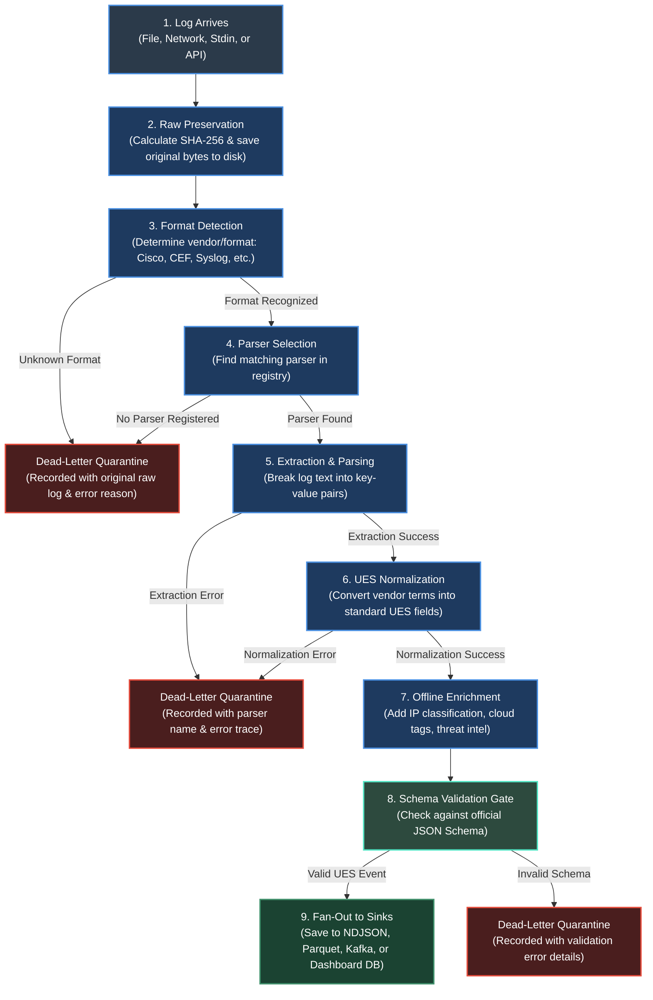

# The Journey of a Log Through ULPF

> A friendly, step-by-step walkthrough of what happens to a single security log from the second it enters the system until it is stored, analyzed, and delivered.

---

## The Big Picture in One Diagram

When a security device (like a firewall, server, or router) generates a log, that log arrives at ULPF as messy, vendor-specific text. Here is the path that single log takes through our system:



---

## Why Trace a Single Log?

In real-world security operations, millions of logs fly past every minute. But inside ULPF, **every single log is treated as an isolated, valuable piece of evidence**.

To understand how the entire system works, you do not need to memorize hundreds of classes or complex math. You only need to follow the life of **one log** through nine distinct steps.

Let's walk through each step together.

---

## Step 1: The Log Arrives (Ingestion)

### What happens?
A log line enters ULPF from the outside world. Depending on how ULPF is deployed, the log might arrive by being read from a text file on disk, piped through standard terminal input (`stdin`), sent live over the network via Syslog (UDP/TCP), or posted to a web REST API.

### Why do we do it?
Different organizations and security appliances ship logs in different ways. Some companies stream logs live over the network, while others dump log bundles into directories every night. ULPF supports multiple readers so it can work in any environment without forcing teams to change their network infrastructure.

### What do we get from it?
We get a `RawEvent` object that contains:
* The exact binary bytes (`raw_bytes`) of the log.
* The decoded text line (`line`).
* A `source_tag` (a label indicating where this log came from, such as `firewall.datacenter1`).
* An `ingest_timestamp` (the exact UTC moment ULPF received it).

### Where does it live in the code?
* File and standard input readers: `ulpf/core/ingestion.py` (`FileReader`, `StdinReader`)
* Live network syslog listener: `ulpf/collectors/syslog_listener.py` (`SyslogListener`)
* REST API: `ulpf/api/app.py` (`/api/ingest` endpoint)

### What happens if it fails?
If a network socket drops or a file cannot be read, the ingestion component logs an error. For text decoding, ULPF uses Python's `surrogateescape` error handler, meaning even weird or corrupt non-UTF-8 bytes will **never crash the reader**—they are safely carried forward without losing a single bit.

---

## Step 2: The Original is Preserved (Raw Storage)

### What happens?
Before ULPF tries to parse, interpret, or alter anything, it immediately takes the exact binary bytes of the log and writes them to a dedicated raw storage folder on disk.

At the exact same time, ULPF computes a cryptographic digital fingerprint (a **SHA-256 hash**) of those raw bytes, and creates a unique, deterministic ID for the event (an **event_id**).

### Why do we do it?
In cybersecurity and digital forensics, the original log is potential legal and investigative evidence. If a parser misunderstands a line or a bug alters the data later, we must always be able to prove what the original device actually sent. 

**Rule number one of ULPF is zero data loss:** We save the raw truth before we do anything else.

### What do we get from it?
* A permanent file on disk (for example, `output/raw_store/a1/b2/a1b2c3d4-....raw`) storing the exact unedited bytes.
* A `raw_hash` (the SHA-256 checksum) ensuring no one can tamper with or dispute the log.
* A reproducible `event_id` that permanently links all downstream records back to this raw file.

### Where does it live in the code?
* Raw storage manager: `ulpf/core/raw_store.py` (`FileRawStore`)
* Hashing and ID creation: `ulpf/core/pipeline.py` (inside `process_event()`)

### What happens if it fails?
If the disk is completely full or permissions are broken, `FileRawStore` raises an exception. Because raw preservation is mandatory for forensic integrity, the pipeline will stop or flag an error rather than silently processing data that cannot be preserved.

---

## Step 3: The Format is Identified (Format Detection)

### What happens?
The log is still just a string of raw characters. ULPF inspects the text to answer a simple question: *"What kind of log is this?"*

The format detector uses smart pattern checks to see if the message looks like a Cisco ASA firewall log, a Common Event Format (CEF) alert, a standard Linux Syslog message (RFC 5424 or RFC 3164), a Palo Alto CSV record, or a JSON blob.

### Why do we do it?
Before you can translate a sentence, you have to know what language it is written in. A Cisco firewall speaks very differently than a Palo Alto gateway or a Linux server. Detecting the format tells the system which specialized translator to call next.

### What do we get from it?
A simple format identifier string, such as `"cisco_asa"`, `"cef"`, `"pan_csv"`, or `"syslog_rfc5424"`.

### Where does it live in the code?
* Format classification: `ulpf/core/detector.py` (`FormatDetector`)
* Optional source configuration overrides: `config/sources.yaml`

### What happens if it fails?
If the log is totally unrecognized and doesn't match any known pattern, the detector returns `"unknown"`. The pipeline catches this immediately, builds a quarantine record containing the raw log and the error `"No parser matched format"`, and writes it to our **Dead-Letter queue** (`output/dead_letter.ndjson`). 

The system increments an error counter, but it **does not crash**—it moves right on to the next log.

---

## Step 4: The Correct Parser is Selected (Parser Registry)

### What happens?
ULPF takes the format string (e.g., `"cisco_asa"`) and asks the Parser Registry for the tool that knows how to read that format.

### Why do we do it?
We keep each log translator in its own separate file so the codebase stays clean and modular. The registry acts like a tool shed: the pipeline asks for the "Cisco ASA" tool, and the registry hands over the matching parser instance.

### What do we get from it?
An active parser object ready to parse the log line.

### Where does it live in the code?
* Parser registration and lookup: `ulpf/core/registry.py` (`get_parser_for_format()`, `get_all_parsers()`)
* Individual parsers: `ulpf/parsers/` directory

### What happens if it fails?
If a format name was recognized but no matching parser class is registered in the code, ULPF tries a dynamic backup: it tests all loaded parsers one-by-one to see if any parser's `.match()` method can claim it. If still no parser can handle it, the event is safely routed to the Dead-Letter queue.

---

## Step 5: The Parser Understands the Log (Extraction)

### What happens?
The selected parser takes the raw text line and extracts all the meaningful pieces of information into a Python dictionary.

For example, if the log is:
```text
%ASA-4-106023: Deny tcp src outside:192.168.1.50/443 dst inside:10.0.0.1/80 by access-group "acl_in"
```

The Cisco parser extracts:
* `action`: `"Deny"`
* `protocol`: `"tcp"`
* `src_interface`: `"outside"`
* `src_ip`: `"192.168.1.50"`
* `src_port`: `443`
* `dst_interface`: `"inside"`
* `dst_ip`: `"10.0.0.1"`
* `dst_port`: `80`
* `rule_id`: `"acl_in"`
* `message_code`: `"106023"`

### Why do we do it?
Computers cannot easily query raw unstructured text. We need to break the text into distinct fields so we can work with IP addresses, port numbers, usernames, and actions programmatically.

### What do we get from it?
A dictionary of vendor-specific key-value pairs (the raw extracted fields).

### Where does it live in the code?
* Base parser interface: `ulpf/parsers/base.py` (`BaseParser.extract()`)
* Vendor parsers: `ulpf/parsers/cisco_asa.py`, `ulpf/parsers/palo_alto.py`, `ulpf/parsers/cef.py`, etc.

### What happens if it fails?
If a log is truncated, corrupted, or has unexpected syntax that causes the parser's regex or splitting logic to throw an exception, ULPF catches the exception. It logs a warning, wraps the raw log along with the exact exception error message, writes the whole record to the Dead-Letter file, and continues processing the next event.

---

## Step 6: The Event is Normalized into UES (Standardization)

### What happens?
This is where the magic of ULPF happens.

The raw extracted dictionary still uses vendor-specific words. For example:
* Cisco calls an allowed connection `"permit"`.
* Palo Alto calls it `"allow"`.
* Linux iptables calls it `"ACCEPT"`.

The **Normalization Engine** takes the vendor dictionary and transforms it into our **Unified Event Schema (UES)**. 

### Why do we do it?
Downstream tools (like security analysts, SIEMs, dashboards, and automated detection rules) should not have to write fifty different rules for fifty different firewall brands. 

By converting all vendor terms into one standard language (UES), a security query like `event.action == 'blocked'` works automatically across every firewall on the planet.

### What do we get from it?
A standardized UES document where:
* `event.action` is normalized to clean canonical values (e.g. `'blocked'` or `'allowed'`).
* `event.outcome` is resolved to either `'success'` or `'failure'`.
* `event.category` is set to `'network'`, `'authentication'`, `'threat'`, `'policy'`, or `'system'`.
* Network fields are organized into standard structures: `network.src_endpoint.ip`, `network.dst_endpoint.port`, `network.transport_protocol`.
* Any vendor-specific fields that do not fit into the standard schema are preserved inside a `vendor_attributes` dictionary so nothing is ever thrown away.

### Where does it live in the code?
* Normalization logic: `ulpf/core/normalization.py` (`NormalizationEngine`)
* Vendor rule mappings: `ulpf/schemas/mappings/*.yaml` (e.g., `cisco_asa.yaml`, `palo_alto.yaml`)
* UES Schema definition: `ulpf/schemas/schema_v1.2.0.json`

### What happens if it fails?
If a mapping file is corrupted or contains an invalid transform, the normalization step catches the error, marks the event as failed, logs the failure, and moves forward safely.

---

## Step 7: The Event is Enriched (Adding Context)

### What happens?
Now that the event is cleanly structured, ULPF passes it through an **Enrichment Plugin**. The plugin looks at the IP addresses in the event and attaches helpful background context.

### Why do we do it?
An IP address like `192.168.1.50` or `185.220.101.5` is just a number. An analyst would normally have to manually check whether that IP is an internal corporate computer, a public cloud server, or a known malicious Tor exit node. ULPF does that work automatically in milliseconds.

### What do we get from it?
An added `enrichment` block attached to the event containing:
1. **Network Scope**: Labels whether the IP is private (RFC 1918), loopback, or public Internet.
2. **Cloud/CDN Provider Identification**: Identifies if the IP belongs to Amazon Web Services (AWS), Microsoft Azure, Google Cloud (GCP), Cloudflare, Fastly, etc.
3. **Offline Threat Intelligence**: Flags if the IP matches known public threat actor lists or Tor exit relays.

> **Important Note:** ULPF's enrichment runs **100% offline and in-memory**. It uses embedded lookup tables, meaning it never makes external internet calls. This guarantees maximum processing speed and ensures ULPF can run safely in air-gapped, highly secure government or military networks.

### Where does it live in the code?
* IP enrichment engine: `ulpf/enrichment/ip_enrichment.py` (`IPEnrichmentPlugin`)
* Enrichment plugin interface: `ulpf/enrichment/base.py`

### What happens if it fails?
Enrichment is considered a non-critical value-add. If enrichment fails on an unusual IP address format, the pipeline logs a warning, but allows the event to proceed without dropping it.

---

## Step 8: The Event is Validated (The Schema Gate)

### What happens?
Before the event is allowed to leave the processing core, it must pass through the **Validator**.

The Validator checks the full event against the official **UES JSON Schema** (`schema_v1.2.0.json`). It verifies that all required fields are present, that timestamps are formatted correctly in ISO-8601 UTC format, that IP addresses are valid, and that data types match expectations.

### Why do we do it?
Quality control. We promise downstream consumers that any event coming out of ULPF is clean, reliable, and perfectly formed. If a bug in a parser produced a malformed field, the Validator stops it right here.

### What do we get from it?
A strict guarantee: either the event is 100% compliant with the UES standard, or it is rejected.

### Where does it live in the code?
* Validation gate: `ulpf/core/validation.py` (`Validator`)
* Official JSON schema: `ulpf/schemas/schema_v1.2.0.json`

### What happens if it fails?
If the event fails validation:
1. The Validator records the exact reason (e.g. `'network.src_endpoint.port: must be integer'`).
2. It packages the `event_id`, the raw log line, and the list of errors.
3. It writes this record to `output/dead_letter.ndjson`.
4. It increments the `invalid` counter and returns `False`.

The invalid event is quarantined so engineers can inspect and fix the parser, while the rest of the pipeline continues running smoothly.

---

## Step 9: The Event Reaches the Outputs (Sinks)

### What happens?
The validated UES event is now complete! The pipeline sends a copy of the event to every configured **Sink** (output destination).

### Why do we do it?
Different users and teams need data in different places:
* A data engineering team might want high-speed columnar files for big-data queries.
* A security operations team might stream logs directly to Apache Kafka or OpenSearch.
* A SOC analyst might view events live in a web browser dashboard.

By keeping sinks decoupled from the pipeline, ULPF can write to one destination or five destinations simultaneously without changing the parsing logic.

### What do we get from it?
The event is written to its final destinations:
* **NDJSON Sink**: Appends the event as a JSON line in `output/normalized_events.ndjson`.
* **Parquet Sink**: Writes compressed columnar files for fast SQL analysis in tools like DuckDB or Apache Spark.
* **Kafka Sink**: Publishes the event to a real-time message stream.
* **SQLite / Dashboard Sink**: Indexes the event into an SQLite database so it instantly appears in the live ULPF Web Dashboard.
* **CEF / LEEF Egress Sinks**: Re-encodes the normalized event back into standard CEF or LEEF syslog streams to forward to legacy SIEMs.

### Where does it live in the code?
* Base sink definition: `ulpf/sinks/base.py` (`SinkBase`)
* Output implementations: `ulpf/sinks/ndjson_file.py`, `ulpf/sinks/parquet_sink.py`, `ulpf/sinks/kafka_producer.py`, `ulpf/sinks/cef_egress.py`, `ulpf/sinks/leef_egress.py`
* Web dashboard database indexer: `ulpf/dashboard/app.py`

### What happens if it fails?
If a specific sink fails (for example, a remote Kafka broker goes offline or a disk runs out of space), the pipeline catches the error, logs it, increments an error counter, and routes an error copy to the dead-letter queue with `_sink_error` and `_failed_sink` tags.

---

## The Golden Rule: No Log Disappears

A core principle of ULPF is that **no log is ever silently lost**. 

Every single incoming log ends up in exactly one of two states:

1. **Success State**: The log was preserved, parsed, normalized into UES, enriched, validated, and written to output sinks.
2. **Quarantine State**: Something went wrong (unrecognized format, parse error, or validation error). The raw log was still preserved in the raw store, and a detailed diagnostic record was written to the Dead-Letter queue so engineers can inspect and reprocess it.

---

## Summary Cheat Sheet

Here is the entire journey summarized in simple terms:

| Step | Action | Plain English Description | Primary Code File |
| :--- | :--- | :--- | :--- |
| **1. Ingestion** | Receive | Accept log from file, network, stdin, or API. | `ulpf/core/ingestion.py` |
| **2. Preservation** | Save Original | Hash bytes with SHA-256 and store exact raw file to disk. | `ulpf/core/raw_store.py` |
| **3. Detection** | Identify | Inspect text to determine log format (Cisco, CEF, etc.). | `ulpf/core/detector.py` |
| **4. Selection** | Find Tool | Look up the matching parser in the parser registry. | `ulpf/core/registry.py` |
| **5. Parsing** | Understand | Break the log text into raw key-value fields. | `ulpf/parsers/*.py` |
| **6. Normalization** | Standardize | Convert vendor-specific fields into standard UES structure. | `ulpf/core/normalization.py` |
| **7. Enrichment** | Add Context | Attach offline IP classification, cloud tags, and threat flags. | `ulpf/enrichment/ip_enrichment.py` |
| **8. Validation** | Check Quality | Verify the event matches the official JSON Schema gate. | `ulpf/core/validation.py` |
| **9. Output** | Deliver | Fan out the validated event to files, Kafka, or the Dashboard. | `ulpf/sinks/*.py` |

---

### In Plain English: The One-Minute Explanation

> A raw log arrives at ULPF. Before touching it, we save an exact byte-for-byte copy to disk and calculate its cryptographic fingerprint so we have permanent, tamper-proof evidence. We inspect the log to see what language it speaks (like Cisco or Syslog) and pick the right translator. The translator breaks the text into fields, and our normalization engine renames those fields into a single universal schema (UES) so all firewalls look the same. We add helpful offline context like whether an IP is in the cloud or private, check the event against our quality schema rules, and finally send it out to our storage files, message queues, and visual dashboards. If anything goes wrong at any step, the raw log and the exact error are safely saved to our dead-letter quarantine queue so nothing is ever lost.
