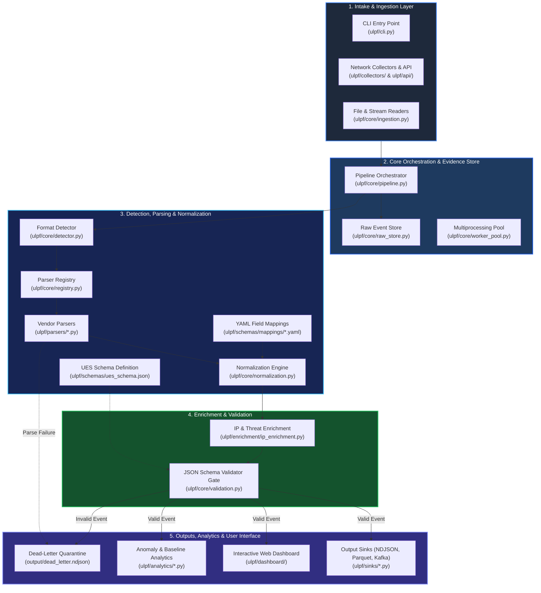

# Diagram 03: The Repository Map

> A practical guide to where everything lives in the ULPF codebase, what each folder does, and how the parts connect together.

---

## The Codebase at a Glance

When you open the `ulpf/` repository, you are looking at a modular set of tools designed to take raw security logs and turn them into clean, structured events. 

Here is how the major functional areas connect to one another:



---

## Major Repository Areas Explained

Let's walk through each directory in `ulpf/` to understand its role.

---

### 1. Ingestion & Collectors (`ulpf/core/ingestion.py`, `ulpf/collectors/`, `ulpf/api/`)

* **What is it?** The front door of ULPF that accepts logs from disk files, standard input (`stdin`), live network sockets, and web APIs.
* **Why do we have it?** Because logs arrive in different ways across different networks.
* **What does it do?** Reads raw byte streams, cleanly strips line breaks, handles decoding safely without crashing on weird characters, and packages them into `RawEvent` objects.
* **Where does it connect?** Passes `RawEvent` objects directly into the `Pipeline`.

---

### 2. Core Processing & Raw Store (`ulpf/core/pipeline.py`, `ulpf/core/raw_store.py`)

* **What is it?** The central engine that coordinates the entire life of an event, plus the forensic store that preserves original data.
* **Why do we have it?** We need a single coordinator to guide a log through each step in the right order, and we need a forensic vault so no original data is ever lost.
* **What does it do?** Computes SHA-256 hashes, generates deterministic UUIDv5 event IDs, writes raw payloads to disk before parsing, invokes detection and parsing, and handles errors safely.
* **Where does it connect?** Calls every other subsystem (detector, parsers, normalizer, enrichment, validator, and sinks).

---

### 3. Format Detection (`ulpf/core/detector.py`, `ulpf/config/sources.yaml`)

* **What is it?** The automated inspection tool that figures out what kind of log just arrived.
* **Why do we have it?** ULPF needs to know which parser should handle a log line without forcing users to manually specify the format for every line.
* **What does it do?** Checks patterns against known signatures (like Cisco ASA tags, CEF headers, Syslog timestamps, or Palo Alto CSV structures). Also checks `sources.yaml` for manual overrides based on source tags.
* **Where does it connect?** Receives raw text from `Pipeline` and returns a format string (e.g. `"cisco_asa"`).

---

### 4. Parsers (`ulpf/parsers/` & `ulpf/core/registry.py`)

* **What is it?** The collection of specialized translators that know how to read individual vendor formats.
* **Why do we have it?** Keeps vendor-specific extraction logic clean, self-contained, and easy to test.
* **What does it do?** Breaks vendor-specific text into structured key-value dictionaries (extracting IPs, ports, usernames, message codes, etc.).
* **Where does it connect?** Called by the `Pipeline` via the `ParserRegistry`; hands its extracted dictionary to the `NormalizationEngine`.

---

### 5. Schemas & UES (`ulpf/schemas/ues_schema.json`)

* **What is it?** The blueprint that defines the **Unified Event Schema (UES)**.
* **Why do we have it?** To provide one clean, shared standard so downstream security systems only have to understand one data format.
* **What does it do?** Defines required fields, data types, timestamp standards, and validation rules for valid UES events.
* **Where does it connect?** Used by `Validator` to check finished events before they leave the core pipeline.

---

### 6. Normalization Engine & Mappings (`ulpf/core/normalization.py`, `ulpf/schemas/mappings/`)

* **What is it?** The engine and YAML rule files that translate vendor field names into standard UES field names.
* **Why do we have it?** Separates *understanding the text* (parsing) from *standardizing the field names* (normalization). This lets us update field mappings in simple YAML files without editing Python code.
* **What does it do?** Maps vendor keys (like `dst_ip` or `destinationPort`) to canonical UES paths, derives event categories, standardizes action outcomes (`success` vs `failure`), and tucks unmapped vendor fields safely into `vendor_attributes`.
* **Where does it connect?** Receives extracted dictionaries from parsers and builds normalized UES event structures.

---

### 7. Enrichment (`ulpf/enrichment/`)

* **What is it?** An in-memory plugin that adds extra intelligence to an event after it is parsed.
* **Why do we have it?** To provide instant context (like identifying cloud providers or private subnets) without requiring external lookups.
* **What does it do?** Tags IP addresses with network scopes (RFC 1918 private vs public), cloud provider labels (AWS, Azure, GCP, Cloudflare), and offline threat flags. Operates 100% offline.
* **Where does it connect?** Sits directly between normalization and validation.

---

### 8. Validation Gate (`ulpf/core/validation.py`)

* **What is it?** The quality control inspector for ULPF.
* **Why do we have it?** To guarantee that corrupt or improperly parsed events never reach downstream storage.
* **What does it do?** Validates normalized events against `ues_schema.json`. If valid, passes them to sinks; if invalid, routes them to `output/dead_letter.ndjson` with detailed error logs.
* **Where does it connect?** The final decision gate before delivery.

---

### 9. Outputs & Sinks (`ulpf/sinks/`)

* **What is it?** The delivery drivers that send processed UES events to their final destinations.
* **Why do we have it?** Different systems need data in different storage formats and transport mechanisms.
* **What does it do?** Writes line-delimited JSON (`ndjson_file.py`), compressed columnar files (`parquet_sink.py`), streaming message queues (`kafka_producer.py`), or re-encodes events for legacy SIEMs (`cef_egress.py`, `leef_egress.py`).
* **Where does it connect?** Receives validated events from the `Pipeline`.

---

### 10. Analytics Engine (`ulpf/analytics/`)

* **What is it?** An anomaly detection and baseline statistical analysis module.
* **Why do we have it?** To identify unusual traffic spikes, rare port activity, and anomalous behavior in processed logs.
* **What does it do?** Extracts numeric features (`features.py`), builds statistical baselines (`baseline.py`), and flags anomalous deviations (`anomaly.py`).
* **Where does it connect?** Analyzes batches of normalized UES events.

---

### 11. Web Dashboard (`ulpf/dashboard/`)

* **What is it?** The interactive web user interface for human analysts.
* **Why do we have it?** Allows teammates and SOC analysts to search, inspect, filter, and monitor logs visually in real time.
* **What does it do?** Runs a lightweight web server with a built-in search indexer (`indexer.py`), real-time event feeds, and interactive visual charts.
* **Where does it connect?** Reads indexed UES events directly from the SQLite dashboard database.

---

## How the Pieces Connect Together

The whole repository fits together in a clean linear chain:

```text
[Ingestion / Collectors] ──► [Pipeline] ──► [Raw Store (Disk Backup)]
                                 │
                                 ├──► [Detector] ──► [Parsers]
                                 │                      │
                                 │                      ▼
                                 ├──► [Normalization & Mappings]
                                 │                      │
                                 │                      ▼
                                 ├──► [Enrichment (Offline)]
                                 │                      │
                                 │                      ▼
                                 └──► [Validator Gate]
                                            │
                   ┌────────────────────────┴────────────────────────┐
                   ▼                                                 ▼
          [Valid Event]                                      [Invalid Event]
                   │                                                 │
                   ▼                                                 ▼
        [Sinks / Dashboard / Analytics]                   [Dead-Letter Quarantine]
```

---

## If I Need to Change Something, Where Do I Look?

When working on ULPF, use this cheat sheet to quickly find the right files:

| If you want to... | Start looking at these repository files... |
| :--- | :--- |
| **Add a new log format** | 1. Create parser in `ulpf/parsers/<name>.py`<br>2. Add mapping in `ulpf/schemas/mappings/<name>.yaml`<br>3. Register in `ulpf/core/registry.py`<br>4. Add detection rule in `ulpf/core/detector.py` |
| **Fix or change field mappings** | `ulpf/schemas/mappings/<vendor>.yaml` and `ulpf/core/normalization.py` |
| **Change the UES schema structure** | `ulpf/schemas/ues_schema.json` |
| **Update IP enrichment or threat ranges** | `ulpf/enrichment/ip_enrichment.py` |
| **Add or modify an output destination** | `ulpf/sinks/` (create or edit a sink class inheriting from `SinkBase`) |
| **Change how logs are read or received** | `ulpf/core/ingestion.py` or `ulpf/collectors/syslog_listener.py` |
| **Modify pipeline execution or raw hashing** | `ulpf/core/pipeline.py` and `ulpf/core/raw_store.py` |
| **Update the Web Dashboard UI** | `ulpf/dashboard/app.py`, `ulpf/dashboard/static/app.js`, `style.css` |
| **Run or add automated tests** | `ulpf/tests/` (run via `pytest` or `Run_Tests.bat`) |

---

## Don't Worry About This Yet

If you are new to the repository, **you do not need to memorize all of these folders right away**.

You can safely ignore:
* The complex regexes inside individual vendor parsers.
* The statistical math inside the analytics engine.
* The low-level socket handling in the syslog collector.
* The multithreaded worker pool mechanics.

Start by understanding how the `Pipeline` moves a log from `ingestion.py` through `parsers/` and into `sinks/`. When you need to work on a specific feature, use the table above to jump directly to the relevant files.
