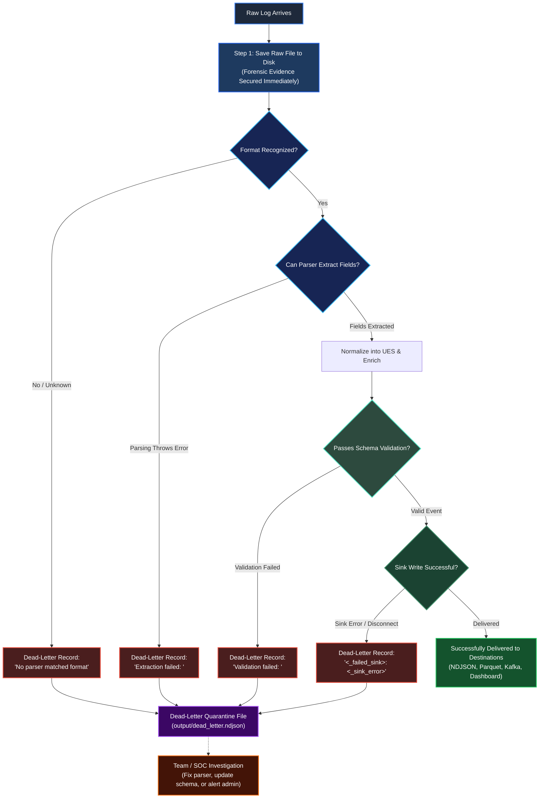

# Diagram 04: The Failure Path

> How ULPF handles broken logs, parse errors, and system failures without crashing or losing data.

---

## When Things Go Wrong

In the real world, log streams are messy. Network cables get unplugged mid-transmission, developers change log formats without warning, and devices send corrupted or malformed lines.

A brittle system crashes when it sees a bad log. A lazy system silently throws bad logs in the trash. 

**ULPF does neither.** Instead, ULPF uses an active **quarantine and failure isolation model**:



---

## The Four Major Failure Points

ULPF protects itself and downstream consumers by checking events at four specific gates:

### 1. Detection Failure (Unrecognized Format)
* **What happened?** A log arrived, but its format does not match any known signatures (Cisco ASA, CEF, Syslog, Palo Alto CSV, JSON, etc.), and no manual rule was set in `sources.yaml`.
* **What ULPF does:** The detector flags the format as `"unknown"`. The pipeline halts normal processing for this single line, packages the original log, and routes it to dead-letter with the message `"No parser matched format"`.
* **Where it lives:** `ulpf/core/detector.py` and `ulpf/core/pipeline.py`.

### 2. Parser Extraction Failure (Malformed Syntax)
* **What happened?** The detector thought the log was a Cisco ASA log, but the line was truncated mid-sentence, corrupted, or contained unexpected characters that caused the parser's regex or field-splitter to throw an exception.
* **What ULPF does:** The pipeline catches the exception safely. It records the parser name, the exact error message, and the raw payload into the dead-letter queue.
* **Where it lives:** `ulpf/parsers/*.py` and `ulpf/core/pipeline.py`.

### 3. Validation Gate Failure (Schema Mismatch)
* **What happened?** The parser extracted fields, but the resulting event broke the rules of the **Unified Event Schema** (`schema_v1.2.0.json`). For example, a required field like `event.category` was missing, a port was formatted as text instead of a number, or a timestamp was invalid.
* **What ULPF does:** The `Validator` rejects the event before it can pollute downstream databases. It records the exact list of schema violations (e.g. `['network.src_endpoint.port: must be integer']`) along with the raw log to the dead-letter file.
* **Where it lives:** `ulpf/core/validation.py`.

### 4. Output / Sink Failure (Destination Down)
* **What happened?** The event is 100% valid, but a specific destination failed (for example, a remote Kafka broker went offline or disk write permissions failed).
* **What ULPF does:** The pipeline catches the sink error, logs a critical error, increments the error counter, and writes an annotated copy of the event containing `_failed_sink` and `_sink_error` tags to dead-letter.
* **Where it lives:** `ulpf/core/pipeline.py` and `ulpf/sinks/*.py`.

---

## Why Raw Preservation Makes Debugging Easy

Notice the most important guarantee in the diagram: **Step 1 happens before any parsing or detection occurs**.

```text
Raw Log Arrives ──► Exact Bytes Saved to Disk & SHA-256 Calculated
                              │
               ┌──────────────┴──────────────┐
               ▼                             ▼
        If processing works           If processing fails
               │                             │
        Clean UES Event               Raw data is STILL on disk!
                                      Look up event_id in raw_store
```

Because ULPF saves the raw binary payload to `output/raw_store/` immediately, **you can always debug any failed event**. You never have to ask a customer or network engineer to reproduce the issue—the exact byte-for-byte evidence is already waiting for you on disk.

---

## What is the "Dead-Letter Queue"?

In simple terms:

> **The Dead-Letter Queue is a quarantine hospital for broken events.**

Instead of mixing corrupted data into clean analytical databases, ULPF writes failed events to a separate file: `output/dead_letter.ndjson`.

Every dead-letter record tells you:
1. **Which event failed** (its unique `event_id`).
2. **What the original log said** (`raw_payload`).
3. **Exactly why it failed** (`error` description and stack message).
4. **When it arrived** (`ingest_timestamp`).

This gives developers and SOC analysts full visibility into what failed without stopping the rest of the stream.

---

## A Concrete Example

Imagine a network glitch cuts a log line in half before sending it:

```text
%ASA-4-106023: Deny tcp src outside:192.168.1.
```

Here is what happens:
1. **Arrival**: Ingestion receives the truncated string.
2. **Preservation**: The bytes are saved to `output/raw_store/`, SHA-256 is computed, and `event_id` is assigned.
3. **Detection**: The detector sees `%ASA-4-106023` and picks the `cisco_asa` parser.
4. **Extraction**: The Cisco parser tries to find the destination IP and port, but they do not exist. An extraction error occurs.
5. **Quarantine**: The pipeline catches the error and writes this entry to `output/dead_letter.ndjson`:
   ```json
   {
     "event_id": "8f3b2a1c-...",
     "raw": {
       "raw_payload": "%ASA-4-106023: Deny tcp src outside:192.168.1.",
       "raw_format": "cisco_asa"
     },
     "error": "Extraction failed: Incomplete connection tuple in log line",
     "parser": "cisco_asa"
   }
   ```
6. **Continuation**: The pipeline moves instantly to the next log line.

---

## What This Means for Teammates

When building or maintaining ULPF, keep these simple principles in mind:

1. **Never assume incoming data is clean**: Real logs are filled with typos, missing fields, and odd encodings. Always use defensive extraction logic.
2. **Never drop a log silently**: If a parser cannot handle a line, let it fail cleanly into dead-letter so it can be fixed.
3. **One failure must never crash the pipeline**: Every event is processed in isolation. A broken log on line 5 should never prevent lines 6 through 1,000,000 from being parsed.

---

## Debugging Mental Model

When investigating why a log did not show up in the dashboard or output sinks, follow this checklist:

```text
Step 1: Open output/dead_letter.ndjson
          ↓
Step 2: Search for your log or timestamp
          ↓
Step 3: Read the 'error' field:
          ├── "No parser matched format"   ──► Update detector.py or sources.yaml
          ├── "Extraction failed: ..."     ──► Fix the regex in parsers/<vendor>.py
          ├── "Validation failed: ..."     ──► Check schema mapping in schemas/mappings/
          └── "Sink write failed: ..."     ──► Check destination connectivity / permissions
```

---

## Summary

> **In ULPF, errors are not ignored—they are captured, quarantined, and diagnosed.** Valid events flow smoothly to your dashboards and storage, while invalid events are safely isolated in the dead-letter queue with their raw evidence intact.
