# ULPF Architecture Documentation

## Overview

Enterprises generate massive volumes of heterogeneous logs across physical network appliances, operating systems, cloud environments, and container platforms. **ULPF (Universal Log Pre-processing Framework)** provides a high-throughput, pluggable, lossless normalization and analytics pipeline that converts multi-format logs into a unified, query-optimized Universal Event Schema (UES v1.1.0).

---

## Complete Pipeline Architecture

```mermaid
flowchart TD
    subgraph Ingestion ["1. Ingestion Layer"]
        A1["FileReader (Batch/Directory)"]
        A2["StdinReader (Pipes)"]
        A3["REST API (/api/ingest/*)"]
        A4["ParallelPipeline (multiprocessing Pool)"]
    end

    subgraph Detection ["2. Detection & Plugin Registry"]
        B["detector.py: FormatDetector\n(Heuristic Priority Engine)"]
        C["registry.py: PARSER_REGISTRY\n(@register_parser Dynamic Discovery)"]
    end

    subgraph Parsing ["3. Parser Plugins (11 Formats)"]
        D1["syslog_rfc5424.py"]
        D2["syslog_rfc3164.py"]
        D3["cef.py"]
        D4["leef.py (1.0 & 2.0)"]
        D5["xml_generic.py (Windows EVTX)"]
        D6["cisco_asa.py"]
        D7["paloalto_csv.py"]
        D8["aws_cloudtrail.py"]
        D9["azure_monitor.py"]
        D10["gcp_audit.py"]
        D11["json_passthrough.py"]
    end

    subgraph Forensic ["4. Forensic Raw Store"]
        E["raw_store.py: FileRawStore\n(Two-Tier Sharded Disk Store\n+ SHA-256 Checksum)"]
    end

    subgraph Normalization ["5. Schema Normalization"]
        F["normalization.py: NormalizationEngine\n(YAML Mapping Declarations)"]
    end

    subgraph Enrichment ["6. Offline Enrichment"]
        G1["ip_enrichment.py: IP Classification\n(RFC1918 / Cloud ASN / Threat CIDR)"]
        G2["composite.py: CompositeEnrichment Chain"]
    end

    subgraph Analytics ["7. Statistical Anomaly Engine"]
        H1["baseline.py: BaselineProfiler\n(Welford Rolling Means/Variances)"]
        H2["anomaly.py: AnomalyDetector\n(Z-Score >3σ, IQR Outliers, Bursts, Rare Categories)"]
    end

    subgraph Validation ["8. Schema Validation & Sinks"]
        I{{"validation.py: Validator\n(Draft 7 JSON Schema v1.1.0)"}}
        J1["sinks/ndjson_file.py: NDJSONFileSink"]
        J2["sinks/kafka_producer.py: KafkaProducerSink"]
        K["output/dead_letter.ndjson (Quarantine)"]
    end

    subgraph Dashboard ["9. Operations & SOC UI"]
        L["dashboard/indexer.py: EventIndexer (SQLite)"]
        M["dashboard/app.py: FastAPI REST Backend"]
        N["dashboard/static: UI (SSE Stream + Traceability Modal)"]
    end

    Ingestion --> Detection
    Detection --> Parsing
    Parsing --> Forensic
    Forensic --> Normalization
    Normalization --> Enrichment
    Enrichment --> Analytics
    Analytics --> Validation
    Validation -->|Valid| J1 & J2
    Validation -->|Invalid| K
    J1 --> Dashboard
```



---

## Core Components

| Module | Purpose |
|---|---|
| `ulpf.core.ingestion` | Concrete readers (`FileReader`, `StdinReader`) emitting immutable `RawEvent` objects. |
| `ulpf.core.detector` | Fast heuristic format classifier ensuring exact parser selection before extraction. |
| `ulpf.core.registry` | Open-closed parser registry utilizing `@register_parser` and dynamic module discovery. |
| `ulpf.core.raw_store` | Cryptographic byte-preservation engine (`FileRawStore`) with two-nibble sharded filesystem storage. |
| `ulpf.core.normalization` | Declarative mapping engine transforming extracted attributes to UES schema using per-parser YAML files. |
| `ulpf.core.validation` | Strict JSON Schema validation routing valid events to sinks and invalid events with errors to `dead_letter.ndjson`. |
| `ulpf.core.worker_pool` | Multi-core parallel processor distributing chunked event batches across isolated process workers. |
| `ulpf.enrichment` | Pure-Python air-gap safe IP context, ASN provider tagging, and embedded threat intelligence detection. |
| `ulpf.analytics` | Statistical anomaly detection calculating online Z-scores, IQR outlier envelopes, burst rates, and rare category signals. |
| `ulpf.sinks` | Line-delimited NDJSON sink for data lakes and `KafkaProducerSink` for real-time SIEM streaming with automatic local fallback. |
| `ulpf.dashboard` | FastAPI server with embedded SQLite indexer, full-text and parameterized search, real-time SSE stream, and cryptographic split inspector. |

---

## Universal Event Schema (UES v1.1.0) Specification

```
event_id                      [string]   UUIDv4 generated per event
ingest_timestamp              [string]   ISO-8601 UTC timestamp of pipeline receipt
source_event_timestamp        [string]   ISO-8601 UTC timestamp parsed from original event (or null)

raw                           [object]   Forensic raw envelope
  raw_payload                 [string]   Untouched original log line
  raw_format                  [string]   Format identifier (syslog_rfc5424, cef, leef, xml, etc.)
  raw_hash                    [string]   SHA-256 hexadecimal hash of raw_payload

source                        [object]   Origin device identity
  vendor                      [string]   Device vendor (Cisco, Palo Alto, AWS, Microsoft, Google, etc.)
  product                     [string]   Device product (ASA, PAN-OS, S3, Azure Monitor, etc.)
  device_hostname             [string]   Hostname / region / cloud project
  source_ip                   [string]   Sending appliance IP (or null)
  log_format                  [string]   Canonical log format

event                         [object]   Categorical event taxonomy
  category                    [string]   network | authentication | threat | system | policy | unknown
  action                      [string]   Normalized or vendor action
  outcome                     [string]   success | failure | unknown | null
  severity_numeric            [number]   Standardized scale (0.0 to 10.0)
  severity_original           [string]   Raw vendor severity string
  event_type_vendor_specific  [string]   Mnemonic, signature ID, or API method

network                       [object]   Network 5-tuple and volume telemetry
  src_ip, dst_ip              [string]   IPv4 / IPv6 addresses
  src_port, dst_port          [integer]  TCP/UDP port numbers (0-65535)
  protocol                    [string]   tcp | udp | icmp | etc.
  bytes_in, bytes_out         [integer]  Byte volume counters
  direction                   [string]   inbound | outbound | internal | unknown
  interface                   [string]   Network interface name

identity                      [object]   User and domain context
  username                    [string]   User / principal / account name
  user_domain                 [string]   Domain / account ID / tenant ID

rule                          [object]   Security policy and rule context
  rule_id                     [string]   Rule identifier / request ID
  rule_name                   [string]   Policy name / event name
  policy_action               [string]   allow | deny | etc.

enrichment                    [object]   Enriched context (Air-gap safe)
  src_ip_context              [object]   IP classification (private, public, loopback), ASN provider
  dst_ip_context              [object]   Destination IP classification
  threat_ip_detected          [boolean]  True if IP matches threat intel CIDR

analytics                     [object]   Statistical Anomaly Detection block
  anomaly_score               [number]   0.0 to 1.0 composite anomaly probability
  anomaly_reasons             [array]    Human-readable explanations for SOC triage
  is_anomalous                [boolean]  True if anomaly_score >= 0.5

lineage                       [object]   Audit and parser provenance
  parser_name                 [string]   Registered parser plugin identifier
  parser_version              [string]   Semantic version of parser plugin
  normalization_ruleset_ver   [string]   Semantic version of YAML ruleset
```
