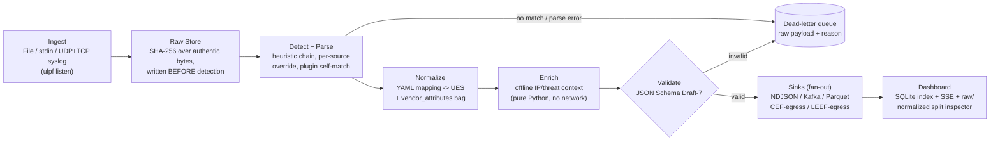

# ULPF Architecture (UES v1.2.0)

ULPF converts heterogeneous perimeter-device logs (syslog, CEF, LEEF, XML,
vendor CSV, cloud-provider JSON) into a single lossless, analytics-ready
Universal Event Schema, while keeping every original byte independently
retrievable for forensics and compliance.

## Pipeline

Every stage is isolated per event: one bad line never stops the run and
never loses data — it is quarantined with its raw payload intact, because
the raw store write happens *before* detection, not after.

## Core components

| Module | Responsibility |
|---|---|
| `core.ingestion` | `FileReader`, `StdinReader` — yield immutable `RawEvent`s with exact bytes preserved |
| `collectors.syslog_listener` | UDP+TCP syslog receiver feeding the same pipeline (`ulpf listen`) |
| `core.detector` | Heuristic format classifier; `sources.yaml` override; falls back to asking every registered parser to self-match |
| `core.registry` | `@register_parser` self-registration via `pkgutil` — adding a format is one file, zero core edits |
| `core.raw_store` | `FileRawStore` — sharded on-disk store keyed by a UUID-validated `event_id`, SHA-256 over authentic bytes |
| `core.normalization` | YAML-declarative mapping engine; unmapped fields fall into `vendor_attributes`, not the floor |
| `core.pipeline` | Orchestrates the stages above; deterministic UUIDv5 `event_id` (tenant + source + raw hash) for idempotent reprocessing |
| `core.worker_pool` | Streams chunked events across a `multiprocessing.Pool` — bounded memory, picklable module-level worker factory |
| `enrichment.*` | Offline RFC1918/threat-CIDR/cloud-ASN classification; annotates, never overwrites source-derived fields |
| `analytics.*` | Z-score, IQR, burst, rare-category, and auth-failure-chain anomaly detection; `analytics.features` emits a 24-dim ML feature vector |
| `sinks.*` | NDJSON, Kafka (with local fallback), columnar Parquet (with NDJSON fallback), CEF/LEEF egress for legacy SIEM receivers |
| `dashboard.*` | FastAPI + SQLite index; CORS restricted to its own origin; write endpoints gated behind an optional `X-API-Key` |

## Universal Event Schema — key guarantees

- **`raw`**: `raw_payload`, `raw_format`, `raw_hash` — the hash is computed
  over the same authentic bytes stored in the raw store, so it always
  verifies, including for non-UTF-8 input.
- **`vendor_attributes`**: every extracted field that has no UES column
  lands here instead of being dropped — the schema is fixed-width, the data
  isn't.
- **`event`**: `category` (network/authentication/threat/system/policy/
  api/database/unknown) plus OCSF-aligned `class_name`/`class_uid`/
  `activity_name`/`activity_id`; `severity_numeric` (0–10) with
  `severity_inferred` distinguishing a real vendor value from a fallback.
- **`lineage`**: `parser_name`, `parser_version`, `normalization_ruleset_version`
  — every event traces back to exactly what produced it.
- **`tenant_id` / `schema_version`**: carried on every event for multi-tenant
  routing and forward-compatible schema evolution.
- Anything failing JSON-Schema validation — or that no parser could even
  match — is written to `dead_letter.ndjson` with its raw payload and reason.
  Nothing is dropped silently.

## Plug-and-play onboarding

Add `parsers/my_vendor.py` (subclass `BaseParser`, implement `match()` /
`extract()`, decorate with `@register_parser`) and
`schemas/mappings/my_vendor.yaml`. `pkgutil` discovery picks it up on
import; `raw.raw_format` and `source.log_format` are taken directly from the
parser's own `log_format` attribute, so a new format's identity survives
end-to-end without touching `detector.py`, `pipeline.py`, or the schema.

## Deployment

Multi-stage Docker build: wheels are built with network access, the
runtime image installs `--no-index --find-links` from those wheels only —
zero outbound calls at runtime, verifiable with `--log-level debug`. The
batch `ulpf` service in `docker-compose.yml` runs with `network_mode: none`;
the dashboard service binds to the host but restricts CORS to its own
origin and accepts an `ULPF_API_KEY` for write-endpoint auth.

## Known limitations

Per-event Draft-7 validation and one-file-per-event raw storage are not yet
tuned for billions-of-events/day throughput; the OCSF alignment is a
crosswalk, not full conformance. See `docs/presentation_outline.md` (Slide 5)
for the honest list.
