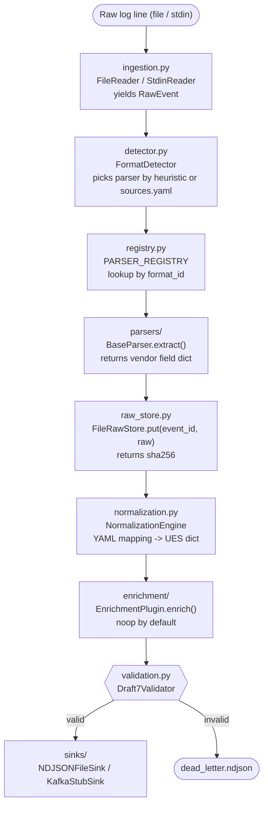

# ULPF Architecture

## The problem

Firewalls, IDS/IPS, VPN gateways, and proxies all log in different formats —
syslog, CEF, vendor CSV, JSON — with different field names and severity scales.
If you want to query across them you have to write separate ETL for each one,
and maintain it every time a vendor updates firmware.

ULPF normalizes all of them into one flat schema without throwing away the
original data. Adding a new vendor means writing one parser file; nothing in
the core pipeline changes.

---

## Pipeline



---

## Modules

| Module | Key classes | What it does |
|---|---|---|
| `core/ingestion.py` | `ReaderBase`, `FileReader`, `StdinReader` | Yields `RawEvent(line, source_tag, ingest_timestamp)`. `ReaderBase` is abstract so a Kafka reader can be added later. |
| `core/detector.py` | `FormatDetector` | Runs a priority-ordered heuristic chain: Cisco ASA > CEF > RFC 5424 > RFC 3164 > PAN CSV > JSON > LEEF > KV. Reads `config/sources.yaml` for manual overrides per source path. |
| `core/registry.py` | `PARSER_REGISTRY`, `@register_parser` | Dict of `format_id -> parser class`. Parsers register themselves at import time via the decorator. |
| `core/normalization.py` | `NormalizationEngine` | Loads `schemas/mappings/*.yaml` on startup and maps extracted fields into UES blocks. Transform hints in the YAML (`_outcome_from_action`, `_direction_from_zones`, etc.) keep the mapping declarative. |
| `core/validation.py` | `Validator` | Checks every event against `schemas/ues_schema.json` (JSON Schema Draft 7). Invalid events get written to `dead_letter.ndjson` with the error list. Nothing is silently dropped. |
| `core/raw_store.py` | `RawStoreBase`, `FileRawStore` | Stores raw bytes at `raw_store/<aa>/<bb>/<uuid>.raw`. Returns the sha256 of the payload, which goes into `raw.raw_hash`. |
| `core/pipeline.py` | `Pipeline` | Runs all stages in order for each event. A failure on one event doesn't stop processing the rest. |
| `parsers/base.py` | `BaseParser` | Abstract class with `match()` and `extract()` plus helpers: `parse_timestamp`, `validate_ip`, `safe_int`, `safe_port`. |
| `parsers/*.py` | 6 plugins | Each implements `match` + `extract`, decorated with `@register_parser`. |
| `sinks/` | `SinkBase`, `NDJSONFileSink`, `KafkaStubSink` | Both use the same `SinkBase` interface. Swapping one for the other doesn't touch `pipeline.py`. |
| `enrichment/` | `EnrichmentPlugin`, `NoOpEnrichment` | Optional stage after normalization. The default does nothing. Implement `enrich(event) -> event` to add geo or TI data. |

---

## Universal Event Schema

Required fields are marked R, nullable are N.

```
event_id                      R  UUID, generated per event
ingest_timestamp              R  ISO-8601 UTC, when ULPF received the line
source_event_timestamp        N  ISO-8601 UTC, from the original log

raw                           R
  raw_payload                    original log line, untouched
  raw_format                     syslog_rfc5424 | syslog_rfc3164 | cef |
                                  leef | json | csv | kv | unknown
  raw_hash                       sha256 of raw_payload bytes

source                        R
  vendor                         e.g. "Cisco", "Palo Alto Networks"
  product                        e.g. "ASA", "PAN-OS"
  device_hostname                FQDN or hostname of the sending device
  source_ip, log_format

event                         R
  category                       network | authentication | threat |
                                  system | policy | unknown
  action                         allow | deny | permit | alert | null
  outcome                        success | failure | unknown | null
  severity_numeric               float 0-10
  severity_original              whatever the vendor sent, as a string
  event_type_vendor_specific     mnemonic or signature ID

network                       N  only present when the log has IP/port info
  src_ip, src_port, dst_ip, dst_port, protocol
  bytes_in, bytes_out, direction, interface

identity                      N  only when the log includes user info
  username, user_domain

rule                          N  ACL or policy info when present
  rule_id, rule_name, policy_action

enrichment                    N  populated by EnrichmentPlugin
  geo_src, geo_dst, threat_intel_tags

lineage                       R
  parser_name                    registered name, e.g. "cisco_asa"
  parser_version                 semver
  normalization_ruleset_version  semver of the YAML mapping file
```

`network`, `identity`, `rule`, and `enrichment` are null when not applicable —
not empty dicts — so queries and ML pipelines don't have to handle both cases.

---

## Traceability

`pipeline.py` generates a UUID before doing anything else. That UUID is:

1. Passed to `FileRawStore.put(event_id, raw_line)` — stores the raw bytes at `raw_store/<aa>/<bb>/<uuid>.raw`
2. Written into the normalized event as `event_id`
3. The sha256 of the raw bytes goes into `raw.raw_hash` in that same event

To recover the original log line: `ulpf lookup --event-id <uuid>`.
To verify integrity: sha256 the stored file and compare to `raw.raw_hash`.

---

## How new parsers work

Add `ulpf/parsers/my_vendor.py` with `@register_parser` on the class, and
`ulpf/schemas/mappings/my_vendor.yaml` with the field mapping. That's it —
`ulpf/parsers/__init__.py` uses `pkgutil.iter_modules` to auto-discover and
import every module in the package at startup, so no import needs to be added
anywhere. `FormatDetector`, `NormalizationEngine`, `Pipeline`, `Validator`,
and the sinks don't change.

---

## Air-gap and containers

Nothing in the default code path makes a network call. All dependencies are
pure-Python wheels.

The Dockerfile has two stages. Stage 1 downloads all wheels while it still has
network access. Stage 2 installs from those local wheels using `--no-index`, so
the runtime image works with `network_mode: none` (set in `docker-compose.yml`).
